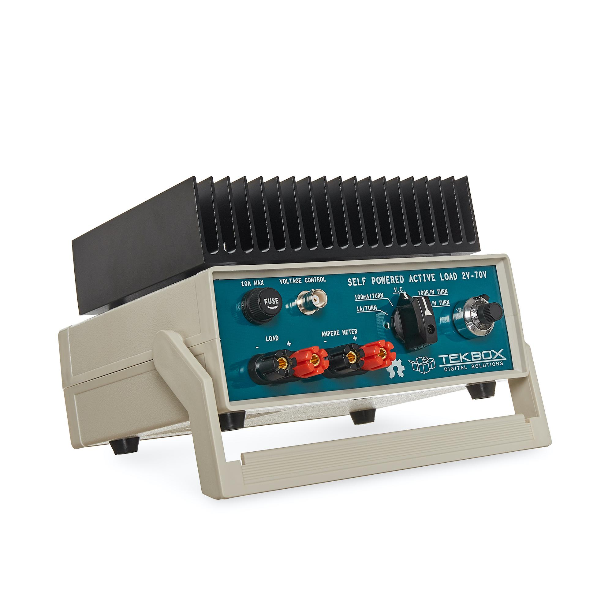

WARNING: This page is in notes format, and may not be of the same quality as other pages on this site.

== Overview

A _AC_ or _DC_ _Electronic Load (a.k.a. _Active Load_) is a piece of electronic test equipment which can act as either a programmable resistance, voltage sink (voltage source, but can only sink power, not produce it) or current sink. They act as a load by converting the incoming electrical power into heat, just like a resistor. However, rather than using a standard fixed resistor (or sequence of switched fixed resistors), they typically use a transistor(s) to dissipate the energy so that it's "resistance" can be changed electronically, hence why they are also known as _active_ loads. They are usually designed to dissipate 100's of Watts or more of power (depending on the model). They are separated into two distinct families:

* DC electronic loads (the most common variety)
* AC electronic loads

AC and DC electronic loads are used to:

* Load up power supplies to test their response under a range of operating conditions (incl. 0A to full current, and 0V to highest voltage)
* Act as constant-current sinks to drive LEDs when performing testing/design validation.

== TekBox TBOH02

The _TekBox TBOH02_ DC load is a great, simple, low-cost DC load. It is self-powered, meaning it powers itself from the energy dissipated via the "load" it pretends to be. 25W continuous power dissipation with no fan, 100W with fan. The advantage of it being an analogue, self-powered load means that there will be no digital/PSU/control-circuitry noise superimposed onto the measurements you are making.

.The TekBox TBOH02 Self-Powered Active Load. Image from https://www.tekbox.com/product/tboh02-self-powered-active-load/.

This device is open-source hardware (design is based of https://www.edn.com/precision-active-load-operates-as-low-as-2v/, however EDN's link to the PDF/schematics is broken as of 2021-06-22), the full schematics, board files and BOM are provided at https://www.tekbox.com/product/tboh02-self-powered-active-load/. Schematics and board files are in the Eagle file format.