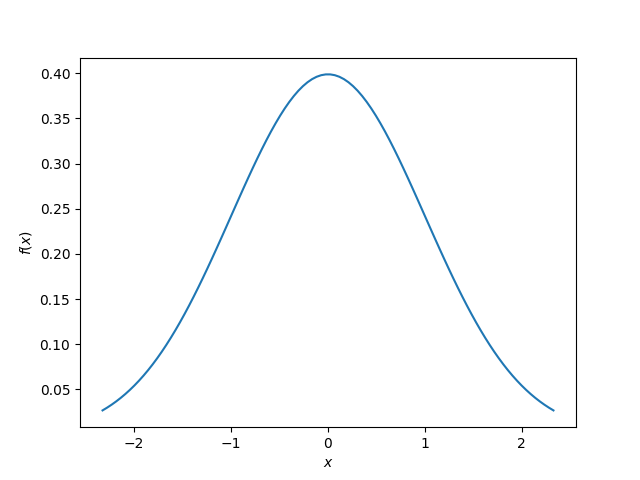
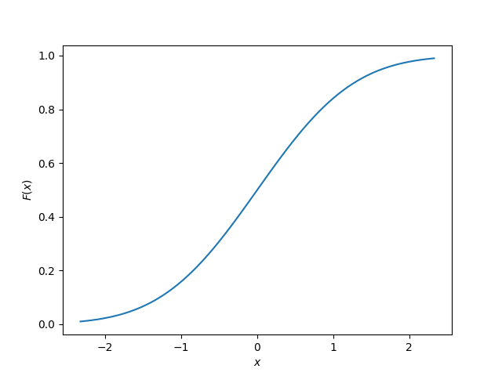
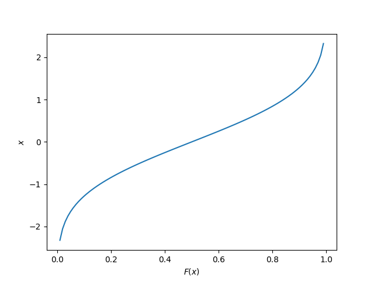

== Overview

== Probability Density Functions (PDFs)

This is the graph you'll typically see when talking about distributions, for example the classic Normal (Gaussian) distribution:

[[pdf-normal]]
.The PDF of the normal distribution, with stem:[\mu=0] and stem:[\sigma=1]. The x-axis has been cut-off at the 1% and 99% percentiles, in reality the function continues from negative infinity to positive infinity. 

This site uses the notation stem:[f(x)] to represent the probability density function of stem:[x].

[stem]
++++
P(a \le x \le b) = \int_a^b f(x) dx
++++

== Cumulative Density Function (CDFs)

The _cumulative density function_ (CDF) is a function which gets a PDF and for any `x`, cumulatively sums up the probability up to that point. The y-axis always starts a stem:[0] and ends at stem:[1].

.The CDF of the normal distribution, with stem:[\mu=0] and stem:[\sigma=1]. The x-axis has been cut-off at the 1% and 99% percentiles, in reality the function continues from negative infinity to positive infinity. The PDF of this distribution is shown in <<pdf-normal>>.

This site uses the notation stem:[F(x)] to represent the cumulative density function of stem:[x].

[stem]
++++
F(x) = P(X \le x)
++++

== Quantile Function

The _quantile function_ is the inverse of the cumulative density function (CDF). Also called the _percentage point function_ (PPF) or _ICDF_ (inverse cumulative density function).

.The quantile function of the normal distribution, with stem:[\mu=0] and stem:[\sigma=1]. The x-axis has been cut-off at the 1% and 99% percentiles, in reality the function continues from negative infinity to positive infinity. The PDF of this distribution is shown in <<pdf-normal>>.

The quantile function is a great way of generating random numbers that follow a specific distribution. Starting with uniformly distributed random numbers in the range from stem:[0] to stem:[1] (which is trivially easy to do in most programming languages), you can transform these numbers with the quantile function into random numbers which follow your specific probability distribution.