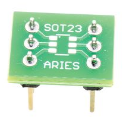
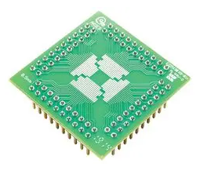

## Overview

Most electronic components come in standardized packages. A package type has well a defined set of physical dimensions that the component has to conform to. For each package, normally the pitch spacing, height and general shape is defined. However most packages contain variants with a differing number of leads (for example the classic old-school DIP package comes in 4, 8, and 10 lead variants just to name a few). This means that total land area and size of a package can vary according to how many leads it has.

Standardizing components sizes and shapes makes it easier for the component manufacturer, the PCB manufacturer, and the design engineer. Although most components are standardized, there are still plenty of packages out there. This pages purpose is to hopefully make some sense of the most common and widely used packages and to help anyone choosing a component package or designing a PCB.

## Component Package Database

Packages are listed alphabetically under the "Child Pages" heading at the top of this page. Click on any package to see more information.

All land-area (occupied PCB space) calculations are based around the minimum-sized square that encloses the entire package. This does not take into account the size of the pads required on the PCB, which would increase the calculation by a small amount. Nominal package dimensions used for calculation.

Click on any photo to expand into a full-sized version.

Component packages with many names (synonyms) are listed by the most common, or most "popular" name, which is not necessarily the technically correct name.

Some items such as the link:pp3-component-package[PP3 9V battery case], and link:sim-card-sizes/[SIM card sizes], may not be strictly component packages, but are included here for completeness.

## Break-out Boards

.A SOIC-8 to DIP break-out board made by SparkFun.
image::sparkfun-break-out-board.jpg[width=160px]

Break-out boards (a.k.a. _IC adapters_) are useful for converting one package footprint into another. They are particular common for converting smaller SMT package footprints into 100mil DIP packages for prototyping with modern ICs.

If not brought from the right place, these break-out boards can be very expensive!

SparkFun is the cheapest supplier of break-out boards that I've found. Element14 also sells them, but at a much higher price.

### ARIES Correct-A-Chip Series

ARIES makes a nice range of not-to-expensive (for one-of prototyping use) breakout boards for a variety of SMD packages as part of their _Correct-A-Chip_ product range. Three examples from this family are shown below.

[.imagerow]
--
.SOT-23-6 to DIP.

.SOIC-16 to DIP. 
image::aries-correct-a-chip-soic-16.png[width=250px,height=200px]

.QFP-64 to PGA (dual-rowed DIP). 

--

Element14 stocks most of the range, which can be found at https://nz.element14.com/w/c/tools-production-supplies/prototyping-tools-breadboards/prototyping-ic-adapters?CMP=KNC-GOO-SHOPPING-2476033&product-range=correct-a-chip.

## Leadframes

_Leadframes_ are the metal structures that are use during the manufacturing of certain component packages (both through-hole and surface mount) to provide the electrical connection from the IC die to the outside world<<bib-wikipedia-leadframe>>. The pins (a.k.a. leads) form part of the leadframe.

Examples of component packages that use leadframes:

* DIP
* QFN
* QFP

## External References

If there is one other site I would direct you to for PCB information, it would be link:http://blogs.mentor.com/tom-hausherr/[Tom Hausherr's blog] on the Mentor Graphics website.

3D models (which can be imported into Altium as step files) can be downloaded from 3D Content Central (link:www.3dcontentcentral.com[www.3dcontentcentral.com]). It is a combination of content submitted from both users and suppliers, can contains many standard component packages in 3D.

SiliconFarEast "IC Package Types" (link:http://www.siliconfareast.com/ic-package-types.htm[http://www.siliconfareast.com/ic-package-types.htm]) - A short but tidy graphical table describing most footprints. Also has data on the body size, body thickness, and lead pitch for the most common variants of each package.

The SMT Code Book (link:http://www.marsport.org.uk/smd/mainframe.htm[http://www.marsport.org.uk/smd/mainframe.htm]) - Handy database for working out what small SMT components are. Since there is usually not enough space to print the entire part number, most manufacturers print their own kind of code of small SMT components. This makes it really hard to determine what they are. To make matters worse, many manufacturers use the same code for different components, and sometimes the manufacturer releases two components with the same code! The trick is to be able to identify the package and the code, and together you can get a good idea of what the component is. The SMT Code Book lists over 3,500 SMT device codes in alphabetical order.

link:http://www.answers.com/topic/surface-mount-technology[Answers.com's Surface-mount Technology page]. Broad spectrum of information regarding SMT components, the production methods and package sizes.

Suggested Pad Layouts For A Number Of Packages (Diodes INC) - Many recommended pad layouts/land patterns for common packages all in one PDF!

Quick-tecks SMT Package Dimensions PDF, which contains hundreds of dimensions for common SMD component packages. You can link:http://www.quick-teck.co.uk/TechArticleDoc/9522698761347382744.pdf[download it from here], or alternatively, use the local link link:/docs/Quick-tecks SMT Package Dimensions.pdf[here].

[bibliography]
## References

* [[[bib-wikipedia-leadframe, 1]]] https://en.wikipedia.org/wiki/Lead_frame
