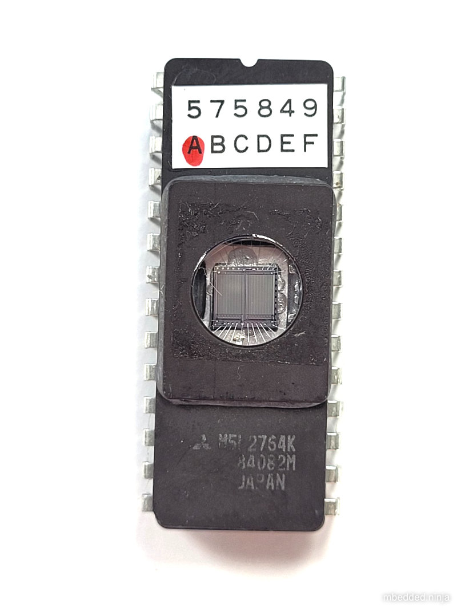

## Overview

[cols="1,3"]
|===
| Name
| DIP (Dual In-Line Package)

| Synonyms
a|
* N Package (Analog Devices)
* DIL (Mitsubishi<<bib-mitsubishi-m5l2764k-ds>>)

| Similar To
a|
* link:../sip-component-package[SIP]
* link:../qip-component-package[QIP]

| Variants
a|
* PDIP (plastic dual-inline package)
* CDIP/CERDIP (ceramic dual-inline package)

| Mounting
| TH

| Pin Count
| 4-64

| Pitch
| 2.54mm (0.1mil)

| Solderability
| Easiest chip package to solder! Perfect for prototyping, fits into standard 100mill pitch prototype board.

| Thermal Resistance
| 

| Package LxWxH
| 5.0mm high

| Typical PCB Land Area
|

| 3D Models
a| See below.

| Common Uses
a|
* Through-hole ICs
* DIP switches
* Relays/reed switches
* 7-segment, 4-digit LCD character display footprints (with different package)
|===

## Comments

The most common through-hole IC package in history, although it is now mostly superseded by SMT packages. Has standard 100mill pitch spacing. The two rows of legs are usually 300mill (thin-type), or 600mill (fat-type) apart (400mil and 900mil variants are also present). The 600mill package is usually reserved for the larger pin variants. As well as standard through-hole mounting, they can also be inserted into a socket, either by friction or clamping (zero insertion force). Pin numbering is counter-clockwise from the top-left.

.A 3D render of the DIP-16 component package.
image::dip-16-component-package-3d-render.jpg[width=300px]

A common way to denominate the package is by width and the number of pins in the form `DIP-<width in inches>-<num. pins>`, e.g. `DIP-300-8` would be a 300mill wide 8-pin DIP package. If the width is not specified, e.g. `DIP-8`, assume it is 300mill wide as this is the most common variant.

Anti-static packaging can easily be made for DIP packages with foam and aluminium foil as shown in the picture below.

.Anti-static packaging can easily be made for DIP packages with foam and aluminium foil.
image::making-antistatic-packaging-for-dip-ic-with-aluminium-foil.jpg[width=500px]

Components other than ICs can also use this footprint (although they typically have different packages). One example are some 7-segment, 4-digit LCD character displays, which use the `DIP-600-12` footprint.

Large DIP packages are unsuitable for high speed devices because of the long length between the internal die and the external pins.

.The iconic 1979 Motorola 68000 CPU in a DIP-600-64 package.
image::motorola-mc68000-dip-package-640x314.jpg[width=500px]

## Land Area

The general land area formula for DIP packages is:

[stem]
++++
A = (\frac{n}{2})*2.54) * (width + 1.65mm)
++++

[.text-center]
where: +
stem:[n] is the number of pins +
stem:[width] is the rated package width in mm (e.g.  7.62 (300mil), 15.24 (600mil)) +

* DIP-300-8 : 94.2mm2
* DIP-300-16: 188.4mm2
* DIP-300-32: 376.7mm2
* DIP-600-32: 686.4mm2  

## 3D Models

<li><a href="http://www.3dcontentcentral.com/download-model.aspx?catalogid=1023&amp;id=79">DIP-300-8</a></li>
<li><a href="http://www.3dcontentcentral.com/download-model.aspx?catalogid=1023&amp;id=71">DIP-300-16</a></li>
<li><a href="http://www.3dcontentcentral.com/download-model.aspx?catalogid=171&amp;id=71043">DIP-300-20</a></li>
<li><a href="http://www.3dcontentcentral.com/download-model.aspx?catalogid=171&amp;id=95319">DIP-600-40</a></li>

## PDIP

A _Plastic Dual Inline Package_ (`PDIP`) is a `DIP` variant in where the case is made from plastic. It typically formed by fusing or cementing the plastic halves around the leads, however it is not considered to be hermetically sealed due to the porous nature of the plastic<<bib-wikipedia-dip>>.

== Exposed Windows

.Photo of the Mitsubishi M5L2764K EEPROM with a transparent lid in a "DIL" (DIP) package.

[bibliography]
== References

* [[[bib-wikipedia-dip, 1]]]: [https://en.wikipedia.org/wiki/Dual_in-line_package](https://en.wikipedia.org/wiki/Dual_in-line_package).
* [[[bib-mitsubishi-m5l2764k-ds, 2]]]: Retrieved 2021-12-27, from https://pdf1.alldatasheet.com/datasheet-pdf/view/126049/MITSUBISHI/M5L2764K.html.
