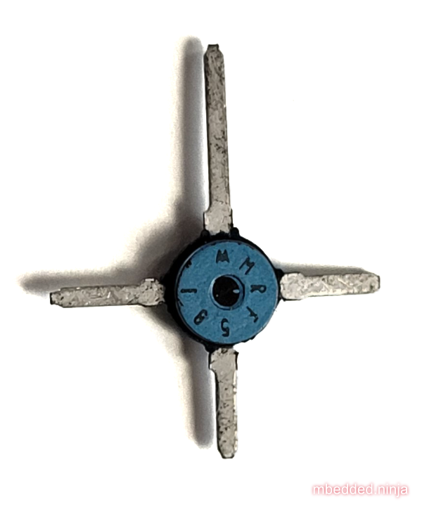

:imagesdir: 

## Overview

[cols="1,3"]
|===
| Name
| 

| Image
a|

| Synonyms
a|
* Micro-X Ceramic<<bib-digikey-mrf581>>
* Package Style M238<<bib-microsemi-mrf581-ds>>

| Similar To
a|
* Macro T

| Variants
| 

| Mounting
| -

| Pin Count
| 4

| Pitch
|

| Solderability
| -

| Thermal Resistance
| -

| Package Dimensions
| -

| Typical PCB Land Area
| -

| 3D Models
a| -

| Common Uses
a|
* RF transistors<<bib-microsemi-mrf581-ds>>

|===

The Macro X component package seems to be obsolete now (2022).

Microsemi's BJT pinout for this package connected the longest lead to the collector, the lead opposite this to the base, and the other two leads to the emitter<<bib-microsemi-mrf581-ds>>.

.Photo of the MRF581 RF NPN transistor in the Macro X component package.

[bibliography]
## References

* [[[bib-microsemi-mrf581-ds, 1]]] Microsemi (2008, Dec). _MRF581: RF & Microwave Discrete Low Power Transistors (datasheet)_. Retrieved 2022-04-18, from https://www.microsemi.com/document-portal/doc_download/11675-mrf581-mrf581a-reva-datasheet.
* [[[bib-digikey-mrf581, 2]]] Digikey. _Microsemi Corporation MRF581 (product page)_. Retrieved 2022-04-18, from https://www.digikey.com/en/products/detail/microsemi-corporation/MRF581/2077046.
