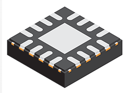

== Overview

[cols="1,3"]
|===
| Name
| SC-89-3

| Synonyms
a|
* 2077-02 (Freescale QFN-16 Pins-5x3 Body-3x3mm)
* CP-32-2 (Analog Devices QFN-32 Pins-8x8 Pitch-0.50mm Body-5x5mm)
* DO-214AC
* HVQFN (NXP's name for a QFN with wettable flanks)
* LFCSP (Analog Devices)
* MLF (Micro-leadframe)
* QFN-UT (Ultra-thin QFN packages by Samtech)
* RQZ (QFN-48, 7x7mm, 050mm pitch by Texas Instruments)
* RSB (QFN-40 by Texas Instruments)
* SOT.... (NXP's name for it's QFN range of packages, not this does not include packages such as the SOT-23, which are NOT QFN packages)

| Similar To
a|
* link:../son-component-package[SON (DFN)]
* link:../uqfn-component-package[UQFN]
* link:../vqfn-component-package[VQFN]

| Mounting
| SMD

| Pin Count
| 12-108

| Pitch
a|
* 0.40mm
* 0.45mm
* 0.50mm
* 0.65mm

| Solderability
| Surprisingly easy to solder by hand, as long as the pads extend around to the sides of the IC, and you drill a hole to solder the centre pad from the reverse. QFN packages can also be soldered easily with a infrared rework station or the 'frying pan' technique.

| Thermal Resistance
| 

| Package LxWxH
a|

Note that the max. height for almost any QFN package is 1mm (including stand-off). Some have a smaller height (e.g. the UT/ultra-thin QFN packages).

*0.40mm pitch QFN packages:*

* QFN-UT-20: 3x3x0.6mm (LA: 9mm2)
* QFN-56: 7x7x1mm (LA: 49mm2)
* QFN-64: 8x8x1mm (LA: 64mm2)
* QFN-72: 9x9x1mm (LA: 81mm2)
* QFN-88: 10x10x1mm (LA: 100mm2)
* QFN-108: 12x12x1mm (LA: 144mm2)

*0.50mm pitch QFN packages:*

* QFN-16: 3x3x1mm (LA: 9mm2)
* QFN-20: 3x3x1mm (LA: 9mm2)
* QFN-24: 4x4x1mm (LA: 16mm2)
* QFN-32: 5x5x1mm (LA: 25mm2)
* QFN-36: 6x6x1mm (LA: 36mm2)
* QFN-48: 7x7x1mm (LA: 49mm2)
* QFN-56: 8x8x1mm (LA: 64mm2)
* QFN-64: 9x9x1mm (LA: 81mm2)
* QFN-68: 10x10x1mm (LA: 100mm2)

*0.65mm pitch QFN packages:*

* QFN-16: 4x4x1mm (LA: 16mm2)
* QFN-20: 4x4x1mm (LA: 16mm2)
* QFN-32: 7x7x1mm (LA: 49mm2)

| Typical PCB Land Area
| See above.

| 3D Models
a|

*0.50mm Pitch:*

* link:http://www.3dcontentcentral.com/secure/download-model.aspx?catalogid=171&amp;id=173415[QFN-20 3x3mm]
* link:http://www.3dcontentcentral.com/secure/download-model.aspx?catalogid=171&amp;id=201710[QFN-36 6x6mm]
* link:http://www.3dcontentcentral.com/secure/download-model.aspx?catalogid=171&amp;id=214813[QFN-56 8x8mm]

*0.65mm Pitch:*

* link:http://www.3dcontentcentral.com/secure/download-model.aspx?catalogid=171&amp;id=167937[QFN-32 7x7mm]
* link:http://www.3dcontentcentral.com/secure/download-model.aspx?catalogid=171&amp;id=413189[QFN-44 8x8mm]

| Common Uses
a|
* Microcontrollers
* High-pin count, low footprint area ICs
|===

The QFN component package is commonly used today for higher pin-count ICs such as microcontrollers. It is a **near chip-scale package**, with all the pins being around the perimeter and an optional thermal pad(s) in the center. It is one of the highest pin-density SMD packages without resorting to BGA. Note that there are different pitch footprints within the QFN family! And QFN packages do not have to be square (square is the most common), some rectangular versions exist with a different number of leads on the two sides (they always have the same number of pins on the opposite side).

QFN packages offer benefits over other packages for high-speed circuits, as well as high heat dissipation capabilities. QFN packages are lacking gull-wing leads (like that present on the QFP package), which create noise in high-speed applications. However because the package is sitting right on the surface of the PCB (or very close to it), they suffer more from mechanical/thermal stress than other SMD packages with larger stand-offs, such as the QFP package. 

Texas Instruments recommends rounded pads on the QFN package to prevent solder bridging. Also, stencil windows are recommended for the solder paste on the thermal pad so that a limited amount of solder is added. Too much solder can cause the QFN package to "float" around during the soldering process.

A QFN-like package with pins on only two of the fours sides is a SON package (DFN).

Confusingly, NXP names it's range of QFN packages with SOT... (e.g, SOT-662-1), a name which is commonly reserved for transitory packages such as the popular SOT-23.

## Solder Mask

TI recommends a non-solder mask defined (NSMD) pad over a solder mask defined (SMD) pad. This is to produce consistent and reliable solder joints. As a rule-of-thumb, you want solder mask openings that are 0.1-0.14mm larger than the pad size. By default, Altium uses NSMD pads.

Some QFN packages have an exposed metal feature on the underside to indicate pin 1. If this is the case, make sure this area is covered with solder mask to prevent shorting to neighbouring traces. This is an unusual feature, and personally I have not used any QFN packages with this present.

## The Central Pad And Solder Paste

It is recommended to reduce the amount of solder paste applied to the centre pad (also called the _mechanical pad_ or _thermal pad_) to prevent the QFN package from floating during reflow. A rule-of-thumb is to have between 50-80% coverage on the center pad (this obviously does not apply to QFN packages with no pad).

.A QFN-68 package with no solder paste aperture reduction on the center pad (not recommended).
image::qfn-68-component-package-with-no-solder-paste-aperture-reduction-on-center-pad.png[width=359px]
.A QFN-68 package with solder paste aperture reduction on the center pad (recommended).
image::qfn-68-component-package-with-solder-paste-aperture-reduction-on-center-pad.png[width=340px]

It may be necessary to mask or plug vias in the center pad to prevent solder paste being carried through the via and away from the pad during reflow. Small holed vias (such as vias with a hole diameter of 0.3mm or less) do not normally cause a big problem.

.A photo of a 0.5mm pitch QFN footprint on a circuit board with solder paste applied (applied manually with a free-standing stencil, so the alignment is not spot-on, but good enough). You can clearly see the windowing (16 windows in total) on the center pad to reduce the amount of solder paste.

The central pad may not necessarily be electrically connected to anything.

## Singulation Methods

There are two singulation methods for QFN packages:

* Punch singulation: This is used on individually-moulded QFN packages.
* Saw singulation: This is used on _moulded array_ QFN packages.

The main difference between these two singulation methods is the cross-sectional profile. **Punch singulation gives a tapered cross-section** (larger cross-section at the bottom than the top), while **sawn singulation gives a completely square cross-section**.

.Cross-sectional comparison of sawn and punch singulated QFN packages. Image from http://cache.freescale.com/files/analog/doc/app_note/AN1902.pdf.
image::qfn-component-package-sawn-vs-punch-vs-col-singulation.png[width=573px]

Punch singulated QFN packages are JEDEC compliant.

## Voiding

**Volatiles that get trapped underneath the pad during reflow can cause voids to form underneath the component** (areas in where the pad is not soldered to the PCB). Another potential cause of voiding is when too much solderpaste is applied to the centre pad, which causes the package to float on the PCB during reflow.

## Stresses

Because the QFN package sits directly on the PCB and has no standoff, **they are less resilient to mechanical stresses that package with leads such as QFP packages**. The amount of PCB board flex must be taken into consideration. Excessive stress can damage a QFN package.

## Lead Styles

.A QFN package with 'e' style leads which are fully exposed on the side of the package (this is a good thing).
image::qfn-package-e-style-leads-fully-exposed-on-side-of-package.png[width=205px]

.A QFN package with 'S' style leads which are only partially exposed on the side of the package (this is a not a good thing).
image::qfn-package-s-style-leads-not-exposed-on-side-of-package.png[width=207px]
.A QFN package with 'WF' style leads. They have dimples which allow for improved soldering.
image::qfn-package-wf-style-dimpled-leads.png[width=206px]

== Unique Corner Pins

QFN packages exist in where the **corner pins have to be of a different shape** to all the others for **clearance reasons**. The only example of this I have ever seen is the package for the link:https://www.invensense.com/products/motion-tracking/9-axis/mpu-9250/[IvenSense MPU-9250 IMU]. It is a QFN package with 24 pins in a 3x3x1.0mm size with 6 0.40mm pitch pins on each edge. Because of the high pin density, the outer pins on each edge almost touch each other, and so a different pin shape is used. This also means you use a different pad shape for the package footprint.

.The corner pins on the QFN package used by the IvenSense MPU-9250 have a unique shape.
image::qfn-24-component-package-with-unique-corner-pads-mpu-9250-dimensions.png[width=306px]

.The footprint for the IvenSense MPU-9250 IMU which uses a QFN package with unique corner pin shapes (notice how they are smaller).
image::qfn-24-component-package-with-unique-corner-pads-mpu-9250-land-pattern.png[width=260px]

## Completely Non-Standard QFN Packages

Aside from the unique corner pins that QFN packages can have (as explained above), **some QFN packages are completely IC specific and do not follow the "standard" at all**. One example is the link:https://www.monolithicpower.com/en/documentview/productdocument/index/version/2/document_type/Datasheet/lang/en/sku/MPM3620GQV/document_id/2092[MPM3620 which comes in a "QFN-20" component package] which has changing pitch, different sized pins, bridged pins and internal pins near the bottom center of the package:

.The package dimensions and recommended land pattern for the non-standard QFN-20 package used on the MPS MPM3620 step-down module.
image::mps-mpm3620-non-standard-qfn-20-component-package.png[width=500px]

## Standardization Of Pinout For Logic Functions

JEDEC has a standard on the pinout of QFN packages for logic functions.

link:/images/2014/12/JESD75-5-JEDEC-Standard-QFN-Pinouts-For-Logic-Functions.pdf[JESD75-5 - JEDEC Standard - QFN Pinouts For Logic Functions]

== Wettable Flanks

Component packages which have _wettable flanks_ have a step-cut lead frame and tin added to the sidewalls of the package. This allows a side fillet of solder to form more reliably, aiding automatic optical inspection (AOI)<<bib-ti-wettable-flanks>> (QFN packages already had pad metallization on the side of the package, but no step-cut nor plating, and side-fillet formation was less reliable).

[cols="1,1", role="unstyled"]
|===
a|
.Model of the underside of a wettable flank QFN package. Image ©2017, Allegro MicroSystems<<bib-allegro-wettable-flanks>>.

a|
.Illustrated cross-section of a wettable flank on a QFN package. Image ©2017, Allegro MicroSystems<<bib-allegro-wettable-flanks>>.

|===

The QFN package is one of the most common packages for a manufacturer to add wettable flanks to. Wettable flanks was largely driven by the need to AOI in the automotive industry but this package feature is now found to be generally useful in a number of industries.

The tin plating of the flank prevents the traditionally exposed copper (a by-product of the sawing singulation of a single QFN package from a "brick") from oxidizing<<bib-allegro-wettable-flanks>>.

## Thermal Resistances

### LFCSP-16

[stem]
++++
\begin{align}
\theta_{JA} = 33.2^{\enspace \circ}C/W \\
\theta_{JB} = 12.4^{\enspace \circ}C/W \\
\theta_{JC} = 2.4^{\enspace \circ}C/W \\
\end{align}
++++

[bibliography]
== References

* [[[bib-ti-wettable-flanks, 1]]] David Snook (2018, Jan 23). _Make automatic optical inspection easy thanks to packages with wettable flanks_. Texas Instruments. Retrieved 2021-10-27, from https://e2e.ti.com/blogs_/b/behind_the_wheel/posts/make-automatic-optical-inspection-easy-thanks-to-packages-with-wettable-flanks.
* [[[bib-allegro-wettable-flanks, 2]]] Bradley Smith (2017). _Wettable Flank Plated PQFN_. Allegro Microsystems. Retrieved 2021-10-27, from https://www.allegromicro.com/en/insights-and-innovations/technical-documents/semiconductor-packaging-publications/wettable-flank-plated-pqfn.
