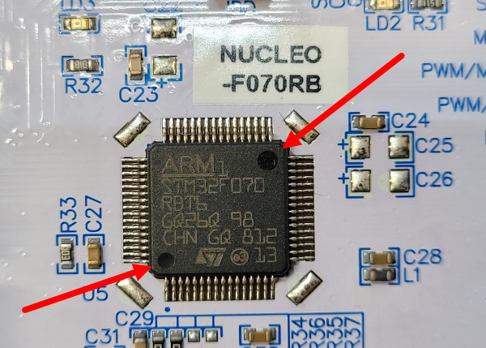
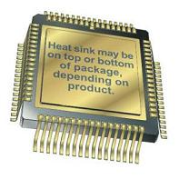

## Overview

[cols="1,3"]
|===
| Name
| Quad Flat Package (QFP)

| Synonyms
a| n/a

| Variants
a|
* BQFP (Bumpered Quad Flat Package)
* CQFP (Ceramic Quad Flat Package)
* FQFP (Fine pitch Quad Flat Package)
* QFP (Quad Flat Package)
* TQFP (Thin Quad Flat Package)

| Similar To
| link:../qfn-component-package[QFN]

| Mounting
| SMD

| Pin Count
| 16-100+

| Pitch
| 0.4-0.8mm (TQFP)

| Solderability
| Reflow recommended. Hand solderable given enough patience and skill, as long as it is not a variant with a thermal pad. Non-zero chance of solder bridges between adjacent pins forming when hand soldering, although these can be easily removed. If you have the option, pick QFN over QFP if hand soldering as QFN doesn't have as many solder bridge issues.

| Thermal Resistance
| 

| Package LxWxH
| n/a

| Typical PCB Land Area
| n/a

| 3D Models
a| n/a

| Common Uses
a|
* Microcontrollers
* FPGAs
|===

The QFP package and most of it's variants are very sensitive to improper handling. Because of the fine pitch, size, and protrusion of the pins, they can be easily damaged and bent before the component is soldered onto the PCB. Although uncommon, the BQFP variant (see below) offers the most pin protection.

.Close-up of the STM32F070RBT6 microcontroller in a LQFP-64 package (mounted on a NUCLEO-F070RV dev kit). For some reason ST decided to put two polarity-looking dots on the package, it's not easy to work out which is the right one! (the dot on the silkscreen gives it away, but imagine if you just had the raw IC!)

== BQFP

_Bumpered Quad Flat Pack_ (BQFP) is a variant of the QFP package which has bumpers on the four corners of the package to protect the pins from bending before the package is soldered to a PCB.

== CQFP

_Ceramic Quad Flat Pack_ (CQFP) is a variant of the QFP package which uses a high-quality ceramic material. The CQFP package can be hermetically sealed and is typically used for space applications.

See the [Texas Instruments Ceramic Quad Flat Pack document link:http://www.ti.com/lit/an/snoa025/snoa025.pdf[SNOA025] (link:/pcb-design/component-packages/qfp-component-package/snoa025-ti-instruments-cqfp-dimensions.pdf[local cached copy]) for package dimensions for CQFP packages from 28 to 304 pins.

.A 3D render of a CQFP component package. Image from analog.com.

== TQFP

The thin-quad-flat-pack package (TQFP) is a leaded, thin SMT package commonly used for microcontrollers. It is one of the most popular variants of the QFN package. It's quite easy to solder these packages and easy enough to probe the individual pins afterwards when testing also.

Pitch: 0.4-0.8mm

.A 3D render of the TQFP-32 component package.
image::tqfp-32-component-package-3d-render.jpg[width=300px]