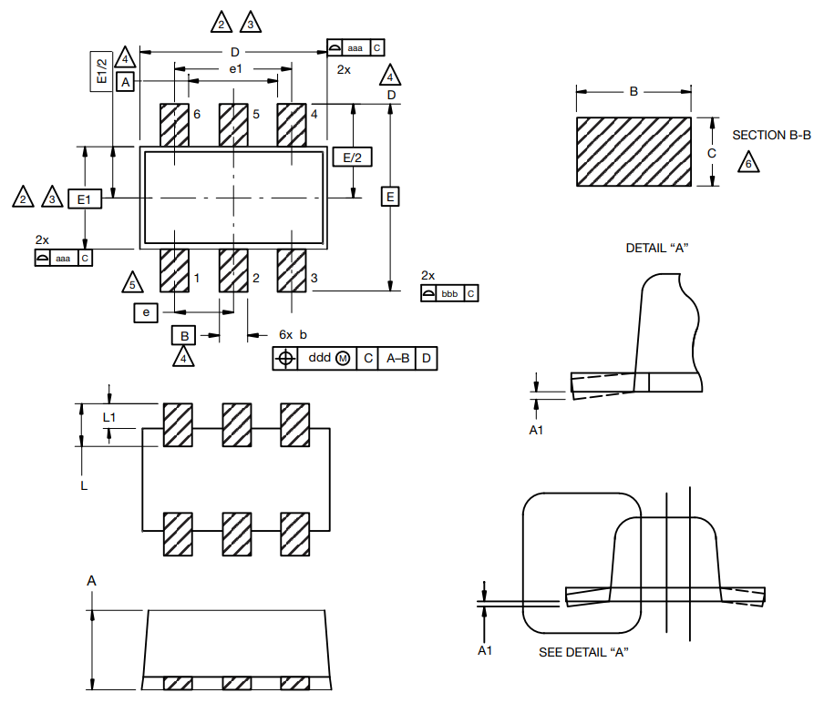
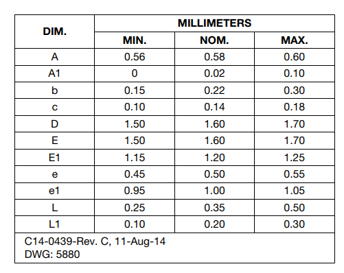

== Overview

The SC-89 comes in two popular variants, the 3-lead SC-89-3 and the 6-lead SC-89-6.

== SC-89-3

|===
| Name | SC-89-3
| Synonyms
a|
* 463C-03 (On Semiconductor)<<bib-on-semi-sc-89-3>>
| Similar To | n/a
| Mounting | SMD
| Pin Count | 6
| Pitch | 1.00mm<<bib-on-semi-sc-89-3>>
| Solderability |
| Thermal Resistance | 
| Package LxWxH | 1.60x1.60x0.58mm<<bib-on-semi-sc-89-3>>
| Typical PCB Land Area | 2.49mm²<<bib-on-semi-sc-89-3>>
| 3D Models | 
| Common Uses
a| n/a
|===

== SC-89-6

|===
| Name | SC-89-6
| Synonyms
a|
* SOD-563
* SOD-563F
* 463C-03 (On Semiconductor)
| Similar To | n/a
| Mounting | SMD
| Pin Count | 6
| Pitch | 0.50mm<<bib-vishay-sc-89-6>>
| Solderability |
| Thermal Resistance | 
| Package LxWxH | 1.60x1.60x0.58mm<<bib-vishay-sc-89-6>>
| Typical PCB Land Area | 2.28mm²<<bib-vishay-si1025x>>
| 3D Models | 
| Common Uses
a|
* MOSFETs
|===

=== Dimensions

.Drawing of the SC-89-6 component package. Retrieved 2021-09-02, from https://www.vishay.com/docs/71612/sc89_6leads.pdf.

.Dimension table of the SC-89-6 component package. Retrieved 2021-09-02, from https://www.vishay.com/docs/71612/sc89_6leads.pdf.

[bibliography]
== References

* [[[bib-vishay-sc-89-6, 1]]] Vishay (2014, Aug 11). _Package Information: SC-89 6-Leads (SOT-563F)_. Retrieved 2021-09-02, from https://www.vishay.com/docs/71612/sc89_6leads.pdf.
* [[[bib-on-semi-sc-89-3, 2]]] On Semiconductor (2003, Jul 21). _Mechanical Case Outline: SC-89, 3 Lead, Case 463C-03 Issue C_. Retrieved 2021-09-02, from https://www.onsemi.com/pub/Collateral/463C-02.PDF.
* [[[bib-vishay-si1025x, 3]]] Vishay (2021, Jul 09). _Si1025X: P-Channel 60 V (D-S) MOSFET_. Retrieved 2021-09-02, from https://www.vishay.com/docs/71433/71433.pdf.
