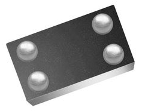
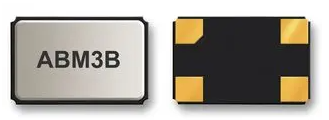
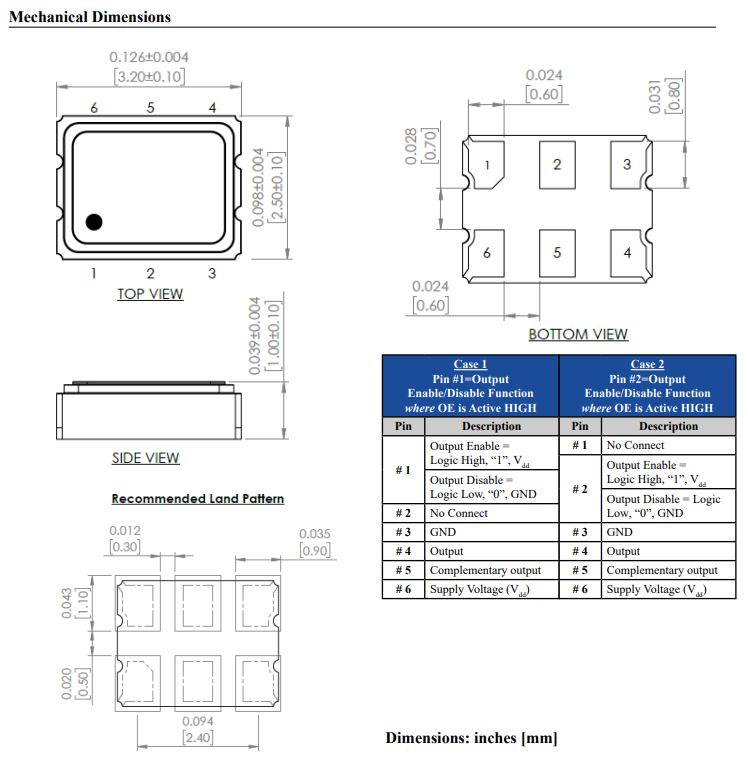

WARNING: This page is in notes format, and may not be of the same quality as other pages on this site.

Unfortunately, most surface-mount crystals do not come in named packages. A notable exception is the link:/pcb-design/component-packages/hc-49us-component-package/[HC-49US package]. This page contains info on the unnamed SMD crystal packages, which are usually identified by their width*length. There are a variety of popular width*length combinations used.

== 2 Pad Packages

.Table of common SMD 2 pad crystal package dimensions
|===
| Dimensions (width x length)

| 1.20x1.00mm
| 1.60x1.00mm
| 2.00x1.20mm
| 2.05x1.20mm
| 3.20x1.50mm
| 4.10x1.50mm
|===

|===
| Dimensions | Num. terminals, connection type | Image | Comment

| 1.5x0.8mm
| 4, BGA
a|
.3D render of the SiTIME SIT1532AI-J4-DCC-32.768E in the 1.5x0.8mm CSP BGA package. Image from https://nz.element14.com/sitime/sit1532ai-j4-dcc-32-768e/osc-32-7khz-1-5-x-0-8mm-lvcmos/dp/2850210.

|

| 3.2x2.5mm
| 4, Pads
a|
.3D render of the Abracon ABM3B-8.000MHZ-10-1-U-T in the 3.2x2.5mm SMD crystal package. Image retrieved 2021-09-07, from https://nz.element14.com/abracon/abm3b-8-000mhz-10-1-u-t/crystal-8mhz-10pf-5-x-3-2mm/dp/2467817.

| A very common package size for a 4 pad SMD crystal. There is also a 6 pad crystal package with the same length and width of 3.2x2.5mm.

| 3.2x2.5mm
| 6, Pads
a|
.Package dimensions of the Abracon AX3DBF1-125.0000T SMD crystal, in a 3.2x2.5x1.0mm form factor. Image retrieved 2021-09-07, from https://nz.mouser.com/datasheet/2/3/AX3-1578477.pdf.

| 

|===
