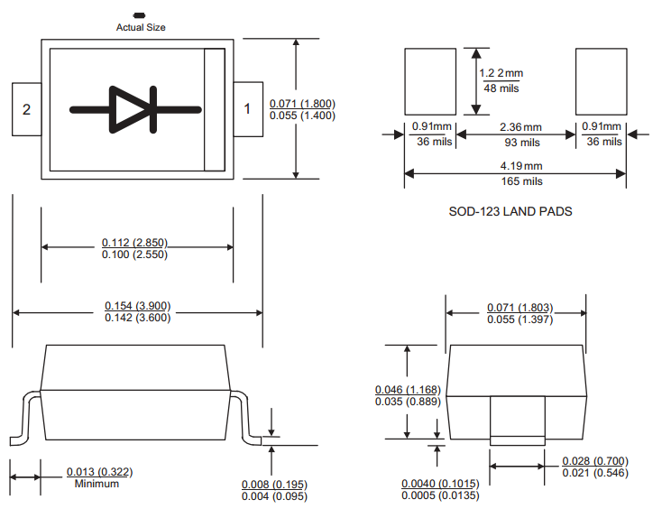
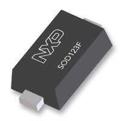
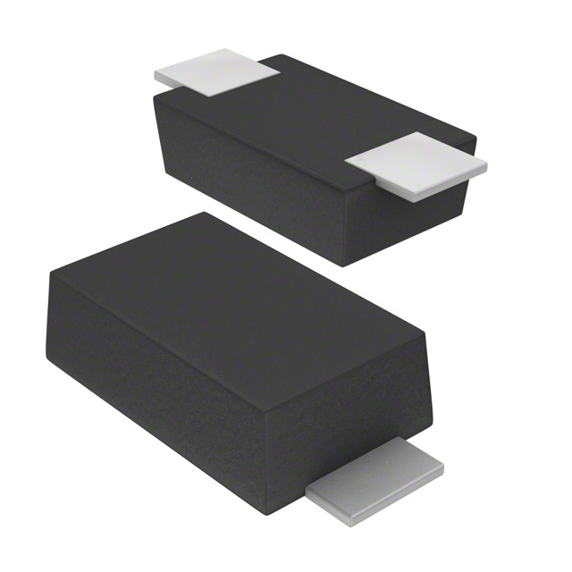
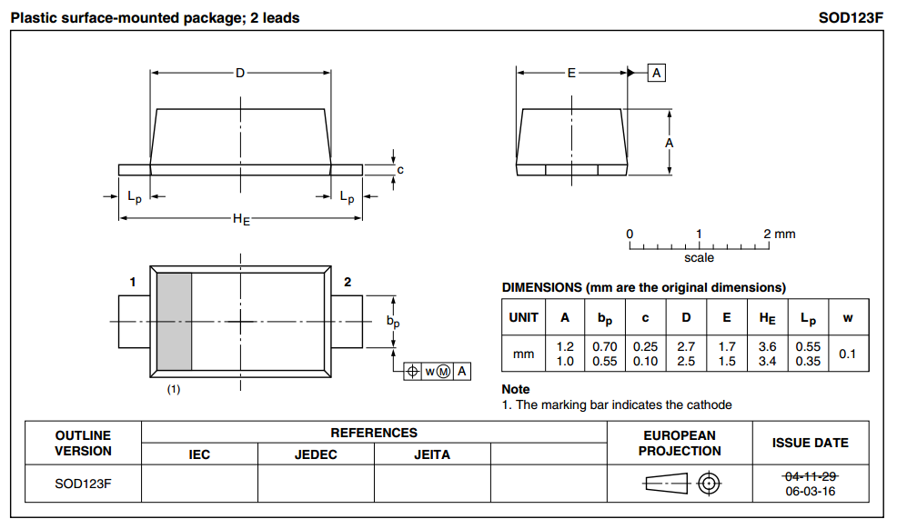
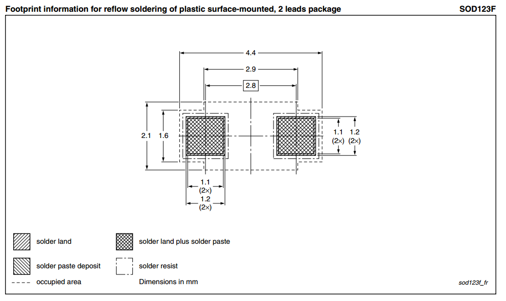
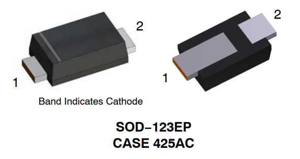
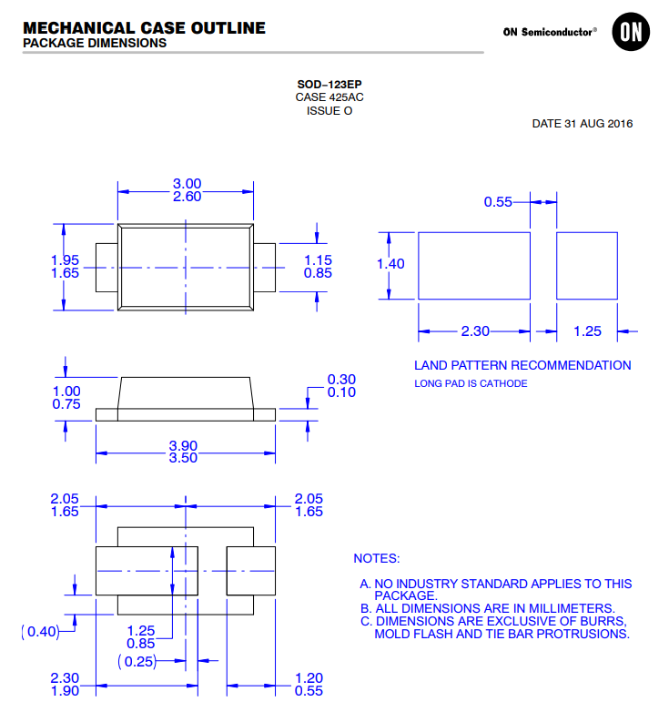
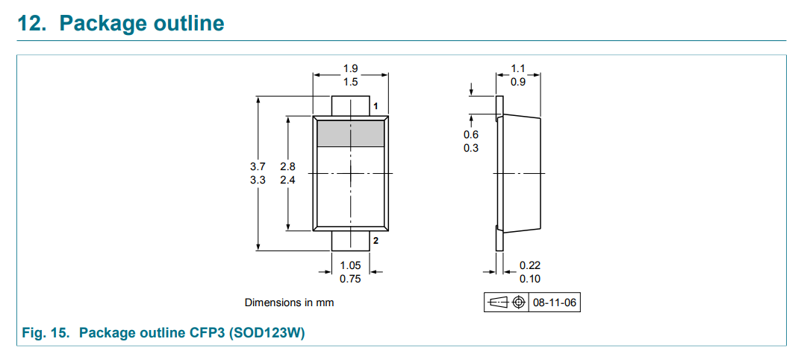

## Overview

[cols="1,3"]
|===
| Name
| SOD-123 (Small-outline diode 123)

| Synonyms
a|
* CASE 425AC (SOD-123EP, OnSemi)<<bib-onsemi-ss12fp-ds>>
* CFP3 (SOD-123W, Nexperia)<<bib-nexperia-pmeg60t20elr-ds>>
* D6 (Fairchild Semiconductor)
* DO-219AA (SOD-123F)
* M1F (SOD-123F, Fagor Electronica)
* PDMU (SOD-123F, Rohm)
* SC-109D
* SOD-123W-2 (SOD-123W, Mouser)<<bib-mouser-diodes-sod-123w-2>>

| Similar To
a| n/a

| Variants
a|
* SOD-123EP
* SOD-123F
* SOD-123FL
* SOD-123W

| Mounting
| SMD

| Pin Count
| 2

| Pitch
| 3.275mm

| Solderability
| Reflow is most suitable. Easily solderable by hand for prototyping.

| Thermal Resistance
| 

| Package LxWxH
| 

| Typical PCB Land Area
|

| 3D Models
a|

| Common Uses
a|
* Diodes

|===

## SOD-123

The _SOD-123_ component package is a small, 2-lead SMD package, commonly used for packaging diodes. The leads are gull-wing style (coming out the side of the package), whilst the `SOD-123F` variant has pads (on the underside of the package).

.A 3D render of the SOD-123 component package. Image from www.digikey.com.
image::sod-123-component-package-3d-render.jpg[width=300px]

### Dimensions And Recommended Footprint

.Dimensions and a recommended footprint (land pattern) for the SOD-123 component package.

Note that the pins in the above diagram are labelled with the diode anode being pin 2, and the cathode being pin 1. This is not what I would consider to be intuitive numbering!

## SOD-123F

The SOD-123F component package has narrow, flat leads protruding from the base of the SMD package.

Synonyms:

* DO-219AA
* PDMU (Rohm)
* M1F (Fagor Electronica)

Pitch: 2.8mm

Recommended Footprint = 4.4x2.1mm = 9.2mm2

.3D model of the top of the SOD-123F component package.

.3D model of the underside of the SOD-123F component package.

.Dimensions of the SOD-123F component package.

.Recommended land pattern for the SOD-123F component package.

## SOD-123EP

The `SOD-123EP` is a variant of the `SOD-123` package with one of the pads being extended further underneath the package for improved power dissipation. This package is typically used for diodes, with the cathode connected to the larger pad<<bib-onsemi-ss12fp-ds>>. Known as `CASE 425AC` by On Semi<<bib-onsemi-ss12fp-ds>>.

.3D model of the SOD-123EP component package. You can clearly see the larger pad on the underside, which in this case is connected to the cathode of the OnSemi SS12FP diode<<bib-onsemi-ss12fp-ds>>.

.Mechanical dimensions of the SOD-123EP component package<<bib-onsemi-ss12fp-ds>>.

## SOD-123W

Synonyms:

* CFP3 (Nexperia)<<bib-nexperia-pmeg60t20elr-ds>>
* SOD-123W-2 (Mouser)<<bib-mouser-diodes-sod-123w-2>>

Dimensions<<bib-nexperia-pmeg60t20elr-ds>>:

* Length: 3.5mm
* Width: 1.7mm
* Height: 1.0mm 

The above dimensions are nominal and include the leads (i.e. outer dimensions). This package the same nominal outer dimensions as the SOD-123F and SOD-123EP variants.

.Package outline for the SOD-123W component package. This outline is taken from the Nexperia PMEG60T20ELR Schottky barrier diode datasheet<<bib-nexperia-pmeg60t20elr-ds>>.

[bibliography]
## References

* [[[bib-onsemi-ss12fp-ds, 1]]] ON Semiconductor (now On Semi) (2021, May). _Surface Mount Schottky Barrier Rectifiers 1 A, 20 V - 150 V: SS12FP - S115FP (datasheet)_. Retrieved 2022-01-36, from https://www.mouser.com/datasheet/2/308/1/S110FP_D-2320074.pdf.
* [[[bib-nexperia-pmeg60t20elr-ds, 2]]] Nexperia (2018, Mar 6). _PMEG60T20ELR: 60 V, 2 A low leakage current Trench MEGA Schottky barrier rectifier (datasheet)_. Retrieved 2022-01-26, from https://www.mouser.com/datasheet/2/916/PMEG60T20ELR-1599911.pdf.
* [[[bib-mouser-diodes-sod-123w-2, 3]]] Mouser. _SOD-123W-2 Schottky Diodes & Rectifiers (search)_. Retrieved 2022-01-26, from https://www.mouser.com/c/semiconductors/discrete-semiconductors/diodes-rectifiers/schottky-diodes-rectifiers/?package%20%2F%20case=SOD-123W-2.
