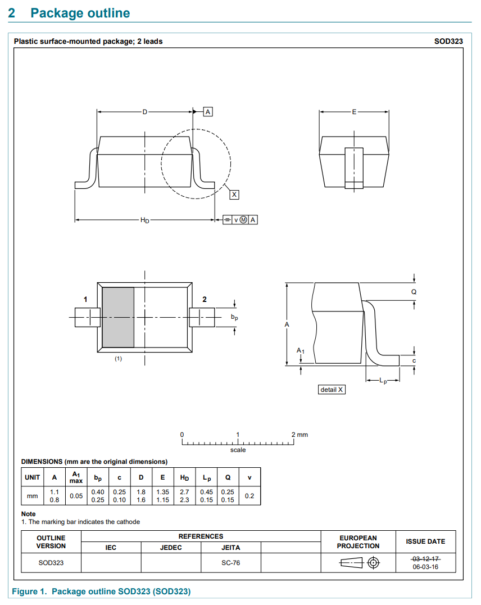
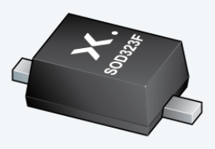
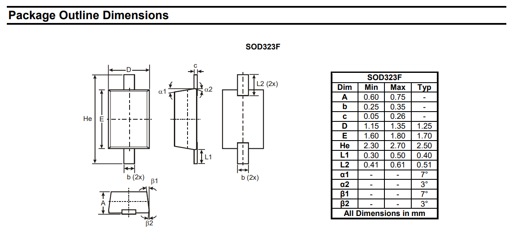
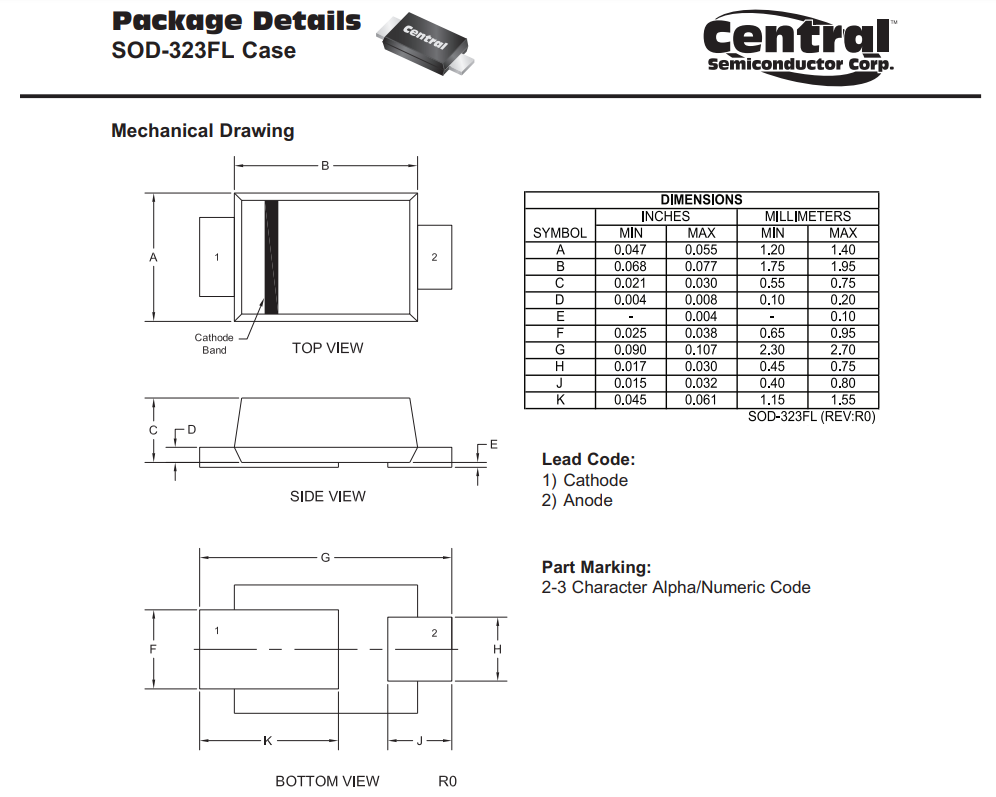
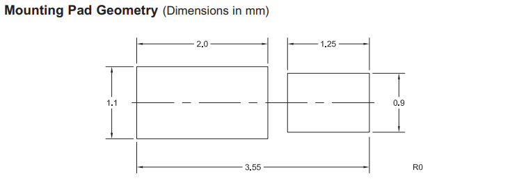
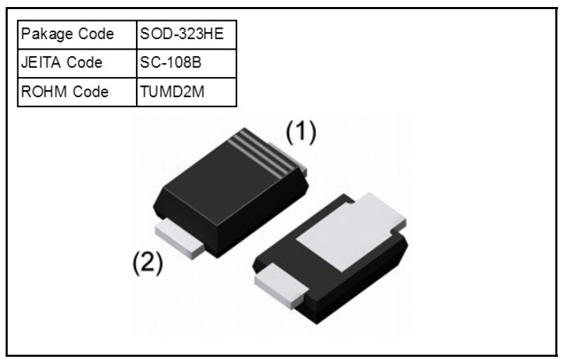
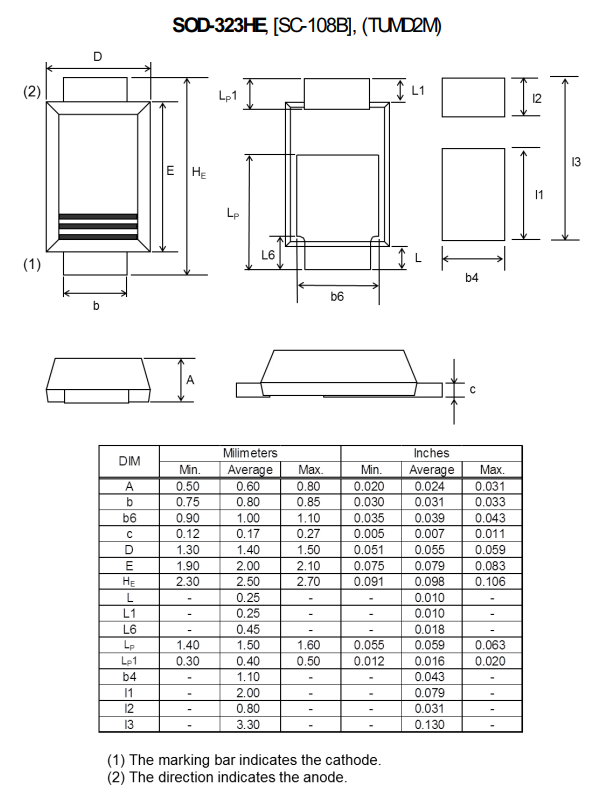

:imagesdir: 

## Overview

[cols="1,3"]
|===
| Name
| SOD-323 (Small-outline Diode 323)

| Image
a|
image::sod-323-sc-76-component-package-3d-render.jpg[width=200px,link="/sod-323-sc-76-component-package-3d-render.jpg"]

| Synonyms
a|

**SOD-323**

* `SC-76` (JEITA)

**SOD-323F**

* `SC-90` (JEITA)

**SOD-323HE**

* `SC-108B` (JEITA)<<bib-rohm-rb558vam150-ds>>
* `TUMD2M` (Rohm)<<bib-rohm-rb558vam150-ds>>

| Similar To
a|
* link:/pcb-design/component-packages/sod-123-component-package/[SOD-123] (larger)
* link:/pcb-design/component-packages/sod-523-sc-79-component-package/[SOD-523] (smaller)
* link:/pcb-design/component-packages/sod-723-sc-104a-component-package/[SOD-723] (even smaller)
* link:/pcb-design/component-packages/sod-923-component-package/[SOD-923] (smallest)

| Variants
a|
* SOD-323: Bent leads.
* SOD-323F: Flat leads (better heatsinking).
* SOD-323FL: Flat leads, with one longer than the other (even better heatsinking).
* SOD-323HE: 

| Mounting
| SMD

| Pin Count
| 2

| Pitch
| 2.2mm<<bib-nxp-sod323-ds>>

| Solderability
| Reflow is recommended. Easy to solder by hand.

| Thermal Resistance
a|
* stem:[R_{\theta(ja)} = 450K/W] (FR4 PCB, single-sided copper, standard footprint)<<bib-nexperia-pmeg2020aea>>
* stem:[R_{\theta(ja)} = 210K/W] (FR4 PCB, single-sided copper, standard footprint but with stem:[1cm^2] mounting pad for cathode)<<bib-nexperia-pmeg2020aea>>
* stem:[R_{\theta(jc)} = 90K/W] (from junction to solder point)<<bib-nexperia-pmeg2020aea>>

| Package Dimensions
a|
* Length: 1.7mm<<bib-nxp-sod323-ds>>
* Width: 1.25mm<<bib-nxp-sod323-ds>>
* Height: 0.95mm<<bib-nxp-sod323-ds>>

| Typical PCB Land Area
| stem:[13.75mm^2] (5x2.75mm)<<bib-nxp-sod323-ds>>

| 3D Models
a| -

| Common Uses
a|
* Diodes
|===

## SOD-323 (Standard Variant)

`SOD-323` is a 2 lead, SMD component package commonly used for diodes. Without any other suffixes, `SOD-323` typically refers to bent lead variant, also know as `SC-76` (JEITA)<<bib-nxp-sod323-ds>>.

.3D model of the `SOD-323` component package.
image::sod-323-sc-76-component-package-3d-render.jpg[width=200px,link="/sod-323-sc-76-component-package-3d-render.jpg"]

|===
| Property | NXP (nominal)<<bib-nxp-sod323-ds>>
| Body Length | 1.7mm
| Body Width  | 1.25mm
| Body Height | 0.95mm
|===

.Dimensions for the `SOD-323` component package<<bib-nxp-sod323-ds>>.

## SOD-323F (Flat Lead Variant)

The `SOD-323F` is a variant which has flat leads instead of the bent leads in the standard `SOD-323`. It has the same body dimensions as the standard `SOD-323`.

**Synonyms**

* `SC-90`: JEITA (EIAJ).
* `SOD-323F-2`: Mouser<<bib-mouser-pmeg2020ejf>>.
* `SOD-323FL`: Rohm<<bib-rohm-udzv33b-ds>>.
* `UMD2`: Rohm<<bib-rohm-udzv33b-ds>>.

WARNING: Rohm uses the name `SOD-323FL` to refer to the same package as many other manufacturers call `SOD-323F`<<bib-rohm-udzv33b-ds>>. Central Semiconductor also uses the package name `SOD-323FL`, but this refers to a different variant with different sized leads (see below).

.3D render of the `SOD-323F` component package<<bib-nexperia-sod-323f>>.

.Package dimensions of the `SOD-323F` component package<<bib-diodes-inc-sod-323f>>.

## SOD-323FL (Central Semiconductor Variant)

Central Semiconductors version of the `SOD-323FL` (the `FL` is presumably an acronym for **F**lat **L**eads) is another variant of the `SOD-323` with flat leads, except one of the leads is much longer than the other<<bib-central-semi-sod-323fl>>. This improves the heatsinking of the package even more than that of the `SOD-323F` variant.

.Package dimensions of the Central Semiconductor `SOD-323FL` component package<<bib-central-semi-sod-323fl>>.

.Recommended land pattern for the Central Semiconductor `SOD-323FL` component package<<bib-central-semi-sod-323fl>>.

## SOD-323HE

The `SOD-323HE` is also known as `SC-108B` (JEITA) or `TUMD2M` (Rohm)<<bib-rohm-rb558vam150-ds>>.

.3D model of the SOD-323HE component package<<bib-rohm-rb558vam150-ds>>.

.Package dimensions of the SOD-323HE component package<<bib-rohm-rb558vam150-ds>>.

[bibliography]
## References

* [[[bib-nxp-sod323-ds, 1]]] NXP (2019, July 30). _SOD323 plastic, surface-mounted package; 2 leads; 1.3 mm pitch; 1.7mm x 1.25 mm x 0.95 mm body (datasheet)_. Retrieved 2022-03-25, from https://www.nxp.com/docs/en/package-information/SOD323.pdf.
* [[[bib-nexperia-pmeg2020aea, 2]]] Nexperia. _PMEG2020AEA: 20 V, 2 A very low VF MEGA Schottky barrier rectifier in SOD323 (SC-76) package (datasheet)_. Retrieved 2022-03-25, from https://assets.nexperia.com/documents/data-sheet/PMEG2020AEA.pdf.
* [[[bib-central-semi-sod-323fl, 3]]] Central Semiconductor (2013, Mar 27). _Package Details: SOD-323FL Case_. Retrieved 2022-03-27, from https://www.centralsemi.com/PDFS/CASE/SOD-323FLPD.PDF.
* [[[bib-rohm-rb558vam150-ds, 4]]] Rohm Semiconductor (2016). _RB558VAM150: Schottky Barrier Diode (datasheet)_. Retrieved 2022-03-27, from https://www.mouser.com/datasheet/2/348/rb558vam150tr_e-1870568.pdf.
* [[[bib-diodes-inc-sod-323f, 5]]] Diodes Incorporated. _SOD-323F: Package Information (datasheet)_. Retrieved 2022-03-27, from https://www.diodes.com/assets/Package-Files/SOD323F.pdf.
* [[[bib-mouser-pmeg2020ejf, 6]]] Mouser. _Nexperia PMEG2020EJF (product page)_. Retrieved 2022-03-28, from https://www.mouser.com/ProductDetail/Nexperia/PMEG2020EJF?qs=45Avz0nZxhu5ApwA0R%252B84A%3D%3D.
* [[[bib-nexperia-sod-323f, 7]]] Nexperia. _Packages -> SC-90 (SOD-323F)_. Retrieved 2022-03-28, from https://www.nexperia.com/packages/SOD323F.html. 
* [[[bib-rohm-udzv33b-ds, 8]]] Rohm Semiconductor (2021, Jan 8). _UDZV: Zener Diode (datasheet). Retrieved 2022-03-28, from https://fscdn.rohm.com/en/products/databook/datasheet/discrete/diode/zener/udzvte-1733b-e.pdf.
