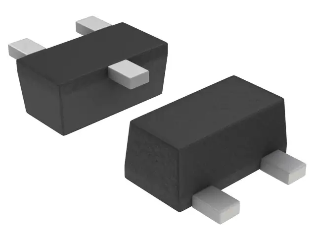

== Overview

|===
| Name | SOD-490
| Synonyms
a|
* 463C-03 (On Semiconductor)<<bib-on-semi-sc-89-3>>
* SC-89-3 (JEITA)
* SOD-490
| Similar To
a|
* SC-89-6
| Mounting | SMD
| Pin Count | 3
| Pitch | 1.00mm<<bib-on-semi-sc-89-3>>
| Solderability | Reflow is most suitable. Possible to hand solder/reflow as long as experienced.
| Thermal Resistance | 
| Package LxWxH | 1.60x1.60x0.58mm<<bib-on-semi-sc-89-3>>
| Typical PCB Land Area | 2.49mm²<<bib-on-semi-sc-89-3>>
| 3D Models
a|
* link:https://www.3dcontentcentral.com/download-model.aspx?catalogid=171&id=363411[3dContentCentral]
| Common Uses
a| n/a
|===

The SC-89-3 has the same package dimensions as the SC-89-6, but just with half the leads missing (similar to the SOT-23-3 vs. SOT-23-6).

.3D model of the SOD-490 (SC-89-3) component package. Retrieved 2021-09-02, from https://www.digikey.co.nz/en/products/detail/onsemi/NTE4153NT1G/687079.

[bibliography]
== References

* [[[bib-on-semi-sc-89-3, 2]]] On Semiconductor (2003, Jul 21). _Mechanical Case Outline: SC-89, 3 Lead, Case 463C-03 Issue C_. Retrieved 2021-09-02, from https://www.onsemi.com/pub/Collateral/463C-02.PDF.
