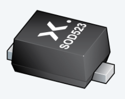
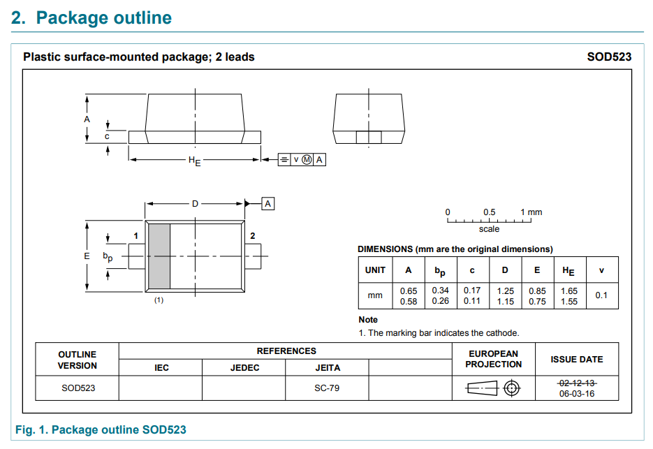
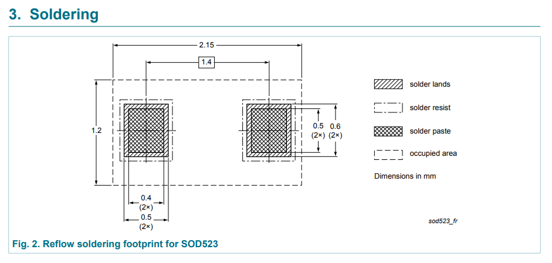

:imagesdir: 

## Overview

[cols="1,3"]
|===
| Name
| SOD-523 (Small Outline Diode 523) (JEDEC)

| Image
a|

| Synonyms
a|
* CASE 502 (onsemi, STYLE 1 has diode polarity mark, STYLE 2 does not<<bib-on-semi-rb751s40-ds>>)
* SC-79 (EIAJ<<bib-nxp-sod523-package-info>>)
* SSMini2-F5-B (Panasonic<<bib-panasonic-db2s308-ds>>)

| Similar To
a|
* link:/pcb-design/component-packages/sod-123-component-package/[SOD-123] (largest)
* link:/pcb-design/component-packages/sod-323-sc-76-component-package/[SOD-323] (larger)
* link:/pcb-design/component-packages/sod-723-component-package/[SOD-723] (smaller)
* link:/pcb-design/component-packages/sod-923-component-package/[SOD-923] (smallest)

| Variants
| None

| Mounting
| SMD

| Pin Count
| 2

| Pitch
| 1.40mm

| Solderability
| Reflow is most suitable. Possible to hand solder/reflow as long as experienced.

| Thermal Resistance
| 

| Package Dimensions
a|
* Length: 1.65mm<<bib-on-semi-rb751s40-ds>>
* Width: 0.80mm<<bib-on-semi-rb751s40-ds>>
* Height: 0.60mm<<bib-on-semi-rb751s40-ds>>

| Typical PCB Land Area
| stem:[2.58mm^2] (2.15x1.20mm)<<bib-nxp-sod523-package-info>>

| 3D Models
a|
* 

| Common Uses
a|
* ESD protection diodes.
* Schottky diodes.
|===

## Comments

The SOD-523 package size (excluding height) of 1.65x0.80mm (length x width) is very similar to the 0603 chip package size of (1.55x0.85mm). SOD-523 is smaller than the SOD-323 package, but larger than the SOD-723 package.

.Package dimensions for the SOD-523 package<<bib-nxp-sod523-package-info>>.

.Recommended land pattern for the SOD-523 package<<bib-nxp-sod523-package-info>>.

[bibliography]
## References

* [[[bib-on-semi-rb751s40-ds, 1]]] ON Semiconductor (now onsemi). _RB751S40: Schottky Barrier Diode (datasheet)_. Retrieved 2022-03-24, from https://www.onsemi.cn/pdf/datasheet/rb751s40t1-d.pdf.
* [[[bib-nxp-sod523-package-info, 2]]] NXP (2022). _SOD523 plastic surface-mounted package; 2 leads (package information)_. Retrieved 2022-03-24, from https://www.nxp.com/docs/en/package-information/SOD523.pdf.
* [[[bib-panasonic-db2s308-ds, 3]]] Panasonic (2013, Apr). _DB2S308 (datasheet)_. Retrieved 2022-03-24, from https://docs.rs-online.com/4e91/0900766b814af80d.pdf.
* [[[bib-nexperia-sc-79-package, 4]]] Nexperia. _SC-79 (SOD523) plastic, surface-mounted package; 2 leads; 1.2 mm x 0.8 mm x 0.6 mm body_. Retrieved 2022-03-24, from https://www.nexperia.com/packages/SOD523.html.
