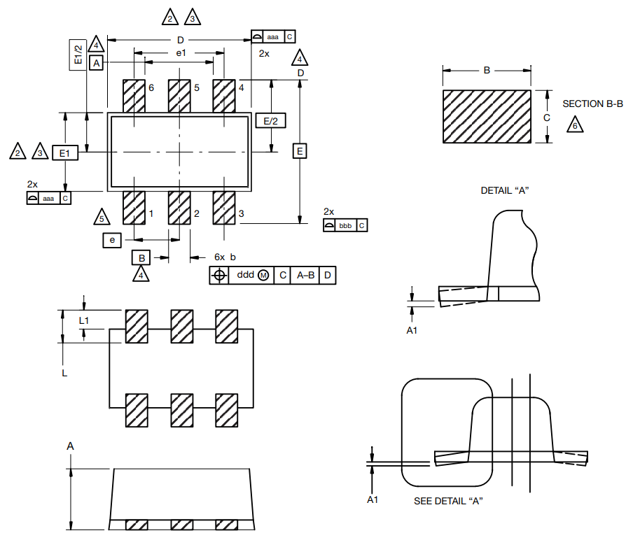

== Overview

|===
| Name | SOD-563
| Synonyms
a|
* 463C-03 (On Semiconductor)
* SC-89-6 (JEITA)
* SOD-563F
| Similar To | n/a
| Mounting | SMD
| Pin Count | 6
| Pitch | 0.50mm<<bib-vishay-sc-89-6>>
| Solderability |
| Thermal Resistance | 
| Package LxWxH | 1.60x1.60x0.58mm<<bib-vishay-sc-89-6>>
| Typical PCB Land Area | 2.28mm²<<bib-vishay-si1025x>>
| 3D Models | 
| Common Uses
a|
* MOSFETs
|===

== Dimensions

.Drawing of the SOD-563 (SC-89-6) component package. Retrieved 2021-09-02, from https://www.vishay.com/docs/71612/sc89_6leads.pdf.

.Dimension table of the SOD-563 (SC-89-6) component package. Retrieved 2021-09-02, from https://www.vishay.com/docs/71612/sc89_6leads.pdf.
image::vishay-sc-89-6-component-drawing-dimensions.png[width=500px]

[bibliography]
== References

* [[[bib-vishay-sc-89-6, 1]]] Vishay (2014, Aug 11). _Package Information: SC-89 6-Leads (SOT-563F)_. Retrieved 2021-09-02, from https://www.vishay.com/docs/71612/sc89_6leads.pdf.
* [[[bib-vishay-si1025x, 3]]] Vishay (2021, Jul 09). _Si1025X: P-Channel 60 V (D-S) MOSFET_. Retrieved 2021-09-02, from https://www.vishay.com/docs/71433/71433.pdf.
