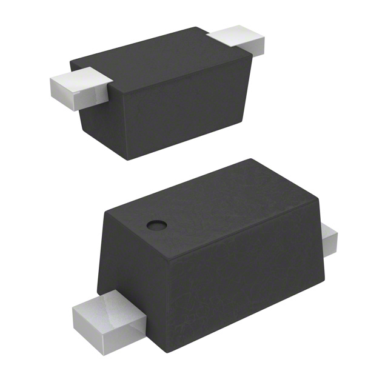
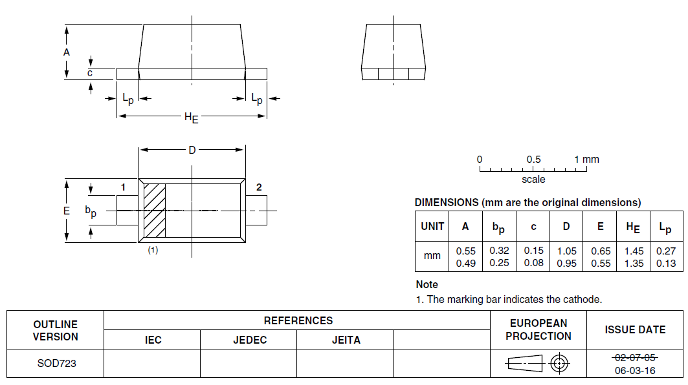
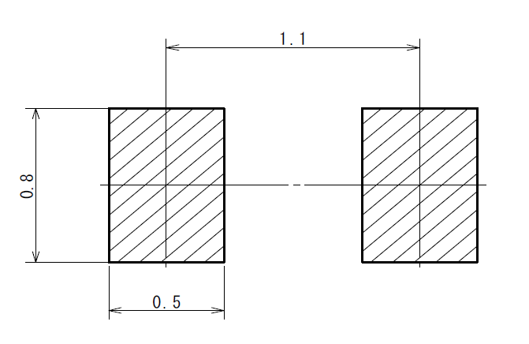

:imagesdir: 

## Overview

[cols="1,3"]
|===
| Name
| SOD-723 (Small-outline Diode 723)

| Image
a|

| Synonyms
a|
* SC-104A (JEITA)<<bib-rohm-vdz27b-ds>>
* VMD2 (Rohm Semiconductor)<<bib-rohm-vdz27b-ds>>

| Similar To
a|
* link:/pcb-design/component-packages/sod-123-component-package/[SOD-123] (largest)
* link:/pcb-design/component-packages/sod-323-sc-76-component-package/[SOD-323] (much larger)
* link:/pcb-design/component-packages/sod-523-sc-79-component-package/[SOD-523] (larger)
* link:/pcb-design/component-packages/sod-923-component-package/[SOD-923] (smaller)

| Variants
| None

| Mounting
| SMD

| Pin Count
| 2

| Pitch
| 1.1mm

| Solderability
| Reflow is most suitable.

| Thermal Resistance
| 

| Package Dimensions
| 

| Typical PCB Land Area
| 

| 3D Models
a| -

| Common Uses
a|
* General purpose diodes
* Schottky diodes
|===

.A 3D render of the SOD-723 component package.

## Dimensions

.2D dimensions drawing of the SOD-723 package. Taken from the NXP SOD-723 datasheet (http://www.nxp.com/documents/outline_drawing/sod723_po.pdf).

## Land Pattern

.The recommended PCB land pattern for the SOD-723 component package.

[bibliography]
## References

* [[[bib-rohm-vdz27b-ds, 1]]] Rohm Semiconductor (2017, Jan 12). _VDZ27B: Zener Diode (datasheet)_. Retrieved 2022-03-25, from https://fscdn.rohm.com/en/products/databook/datasheet/discrete/diode/zener/vdzt2r27b-e.pdf.