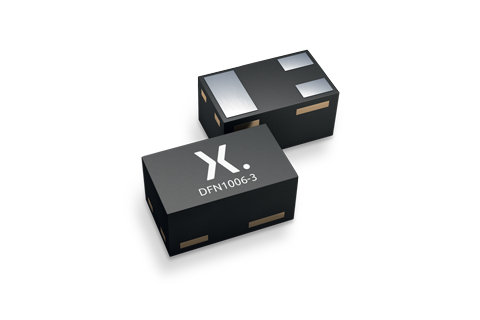
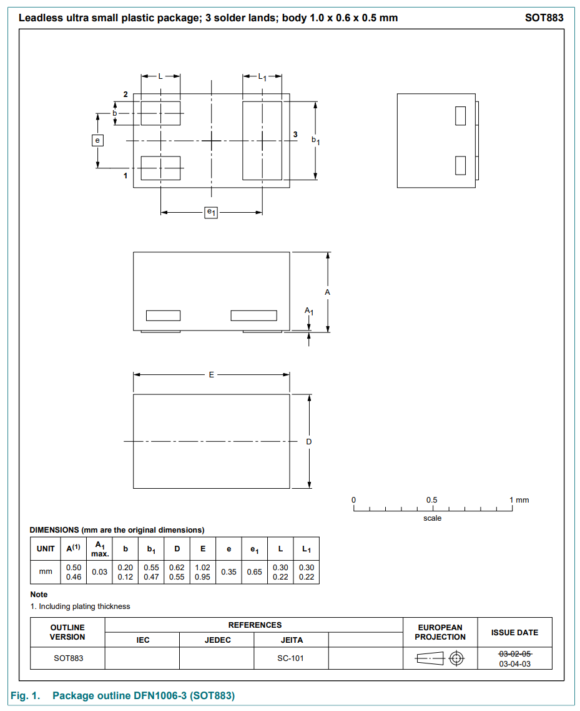
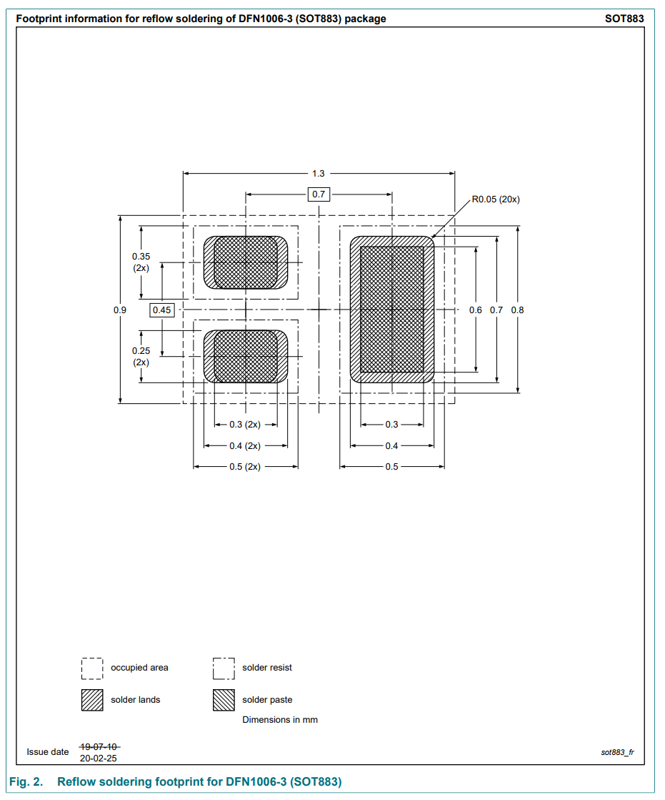

:imagesdir: 

## Overview

[cols="1,3"]
|===
| Name
| SOT-883 (Small-outline Transistor 883)

| Image
a|

| Synonyms
a|
* `CASE 506DB` (onsemi<<bib-on-semi-ntns3c68nz-ds>>)
* `DFN1006-3` (NXP<<bib-nexperia-sot-883>>)
* `SC-101` (JEITA, EIAJ)<<bib-nexperia-pbss2515m-ds>>       
* `XDFN3` (onsemi)

| Similar To
a|
* link:/pcb-design/component-packages/dfn-component-package/[DFN]
* link:/pcb-design/component-packages/sod-882-component-package/[SOD-882] (2 pins instead of 3, in the same sized package)

| Variants
| None

| Mounting
| SMD

| Pin Count
| 3

| Pitch
a|
* 0.35mm between the centers of the two small pads (called the nominal pitch by Nexperia)<<bib-nexperia-sot-883>>
* 0.65mm between the centers of the small pads and the large pad (called the minimal pitch by Nexperia)<<bib-nexperia-sot-883>>

| Solderability
| Almost impossible to solder with a hand-held soldering iron due to the pads being on the bottom of the package. Need to use reflow oven/hot air soldering techniques.

| Thermal Resistance
a|
* 

| Package Dimensions
a|
* Length: 1.0mm (nom)<<bib-nexperia-sot-883>>
* Width: 0.6mm (nom)<<bib-nexperia-sot-883>>
* Height: 0.50mm (nom)<<bib-nexperia-sot-883>>

| Typical PCB Land Area
| stem:[1.17mm^2] (1.30x0.90mm)<<bib-nexperia-sot-883>>

| 3D Models
a| -

| Common Uses
a|
* MOSFETs
|===

The `SOT-883` component package is very similar to a DFN package. It is also very similar to the link:/pcb-design/component-packages/sod-882-component-package/[SOD-882 component package] (note: that's `SOD`, not `SOT`!). It has the same outside dimensions as the `SOD-882`, except with the addition of an extra pad. This presumably explains the transition from `SOD` to `SOT` -- the two pin package is used for diodes, whilst this three pin package is used for transistors.

onsemi (formally On Semiconductor) calls this package the `XDFN3`<<bib-on-semi-ntns3c68nz-ds>>. However, you have to be careful as onsemi also uses the name `XDFN3` for slightly different packages, for example, the NTNS5K0P021Z MOSFET, which has a smaller package size of 0.62x0.42x0.4mm<<bib-on-semi-ntns5k0p021z-ds>>, rather than 1.0x0.6x0.5mm of the `SOT-883`. The key difference is the "case code" which is `CASE 506CB1`<<bib-on-semi-ntns3c68nz-ds>> for the SOT-883, but `CASE 711BH`<<bib-on-semi-ntns5k0p021z-ds>> for the smaller 0.62x0.42x0.4mm package.

## 3D Render

.A 3D render of the SOT-883 component package. Image from https://assets.nexperia.com/documents/package-information/SOT883.pdf.

## Package Dimensions

.The dimensions of the SOT-883 component package. Image from https://assets.nexperia.com/documents/package-information/SOT883.pdf.

## Recommended Footprint

.The recommended PCB footprint for the SOT-883 component package. Image from https://assets.nexperia.com/documents/package-information/SOT883.pdf.

[bibliography]
## References

* [[[bib-nexperia-sot-883, 1]]] Nexperia (2020, Sep 25). _SOT883: plastic, leadless ultra small package; 3 terminals; 0.35 mm pitch; 1 mm x 0.6 mm x 0.48 mm body (package information)_. Retrieved 2022-04-02, from https://assets.nexperia.com/documents/package-information/SOT883.pdf.
* [[[bib-nexperia-pbss2515m-ds, 2]]] NXP (now Nexperia) (2003, Jun 17). _PBSS2515M: 15 V, 0.5 A NPN low VCEsat (BISS) transistor (datasheet)_. Retrieved 2022-04-03, from https://assets.nexperia.com/documents/data-sheet/PBSS2515M.pdf. 
* [[[bib-on-semi-ntns3c68nz-ds, 3]]] On Semiconductor (now onsemi) (2019, Jun). _NTNS3C68NZ: MOSFET - Single, N-Channel, Small Signal, SOT-883, (XDFN3), 1.0 x 0.6 x 0.4 mm 12 V, 758 mA (datasheet)_. Retrieved 2022-04-03, from https://www.onsemi.com/pdf/datasheet/ntns3c68nz-d.pdf.
* [[[bib-on-semi-ntns5k0p021z-ds, 4]]] On Semiconductor (now onsemi) (2019, Jun). _NTNS5K0P021Z: MOSFET - Single P-Channel, Small Signal, XDFN3, 0.62 x 0.42 x 0.4 mm, -20 V, -127 mA (datasheet)_. Retrieved 2022-04-03, from https://www.onsemi.com/pdf/datasheet/ntns5k0p021z-d.pdf.
