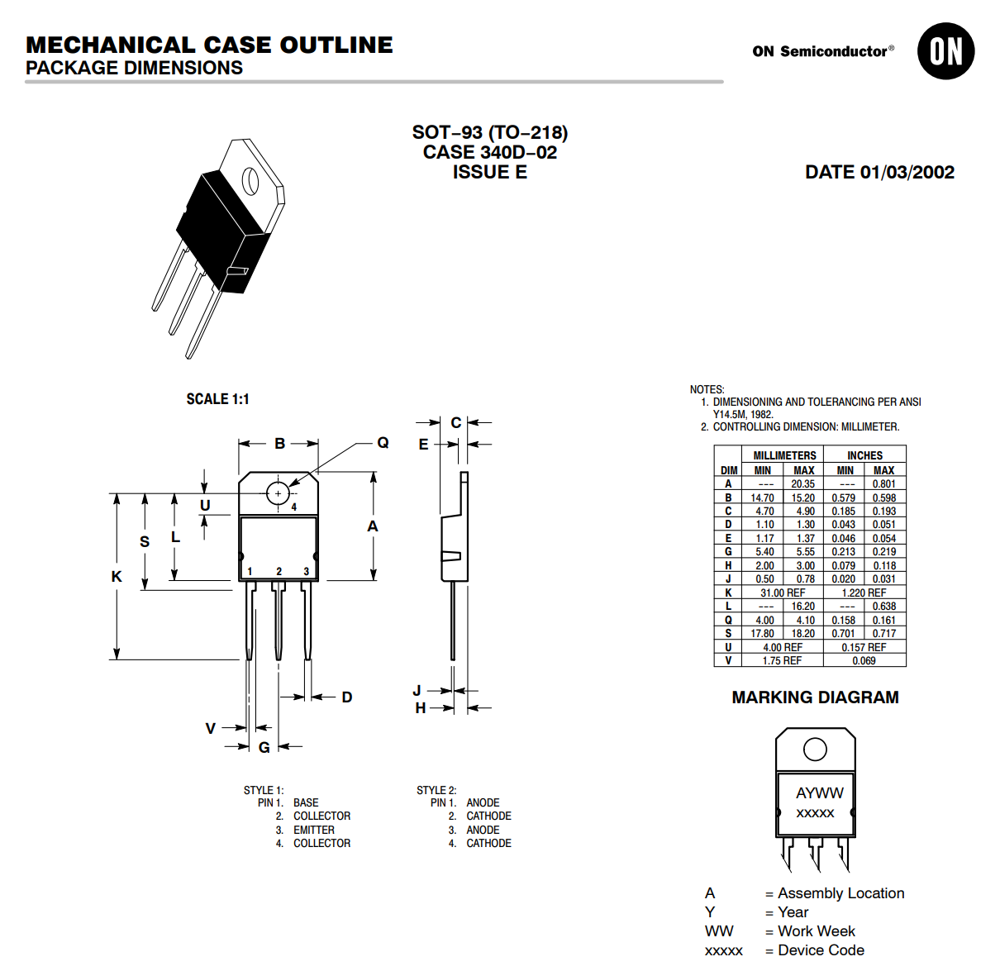
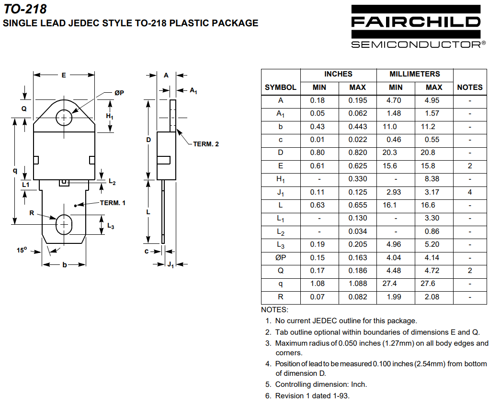

## Overview

[cols="1,3"]
|===
| Name
| TO-218 (Transistor Outline 218)

| Synonyms
a|
* CASE 340D-02 (On Semi)<<bib-on-semi-package-change>>
* SOT-93 (On Semi)<<bib-on-semi-sot-93>>

| Similar To
a|
* link:../to-247-component-package[TO-247] (the TO-247 is considered the "upgrade" from this package)

| Variants
a|
* TO-218-3 (3 lead variant, most common)
* TO-218-1 (1 lead variant, have not found any components in this package, only a reference to it's dimensions)

| Mounting
| TH

| Pin Count
| 2-5<<bib-eesemi-to-218-package>>

| Pitch
| 5.45mm (0.215")<<bib-on-semi-package-change>>

| Solderability
| Suitable for wave soldering. Easy to solder by hand.

| Thermal Resistance
| 

| Package LxWxH
| 15.20x4.90x20.35mm  (max)<<bib-eesemi-to-218-package>>

| Typical PCB Land Area
| n/a

| 3D Models
a| n/a

| Common Uses
a|
* BJTs
* MOSFETs
|===

## TO-218-3 (3 Lead Variant)

<<to-218-package-dimensions-on-semi>> shows the dimensions of the TO-218-3 component package.

[[to-218-package-dimensions-on-semi]]
.Package dimensions of the TO-218 component package<<bib-on-semi-sot-93>>.

When housing a BJT, the pinout is usually:

* 1: Base
* 2: Collector
* 3: Emitter
* 4 (Tab): Collector

## TO-218-1 (1 Lead Variant)

Fairchild Semiconductor has dimensions for a "single-lead" TO-218 package, as shown in <<to-218-single-lead-dimensions-fairchild-semiconductor>>. Curiously, I have not found any components that use this package.

[[to-218-single-lead-dimensions-fairchild-semiconductor]]
.Dimensions for a single-lead TO-218 component package<<bib-fairchild-to-218-single-lead>>.

[bibliography]
## References

* [[[bib-on-semi-package-change, 1]]] On Semiconductor (2012, Jun 9). _Final Product/Process Change Notification #16827:  Package change from TO-218 to TO-247 for all Bipolar Power Transistors_. Retrieved 2021-12-24, from https://www.mouser.com/PCN/ON%20Semiconductor_16827.pdf.
* [[[bib-fairchild-to-218-single-lead, 2]]] Fairchild (2001, Oct). _TO-218 Single Lead JEDEC Style TO-218 Plastic Package_. Retrieved 202-12-24, from https://www.icbanq.com/icbank_data/semi_package/to218_dim.pdf.
* [[[bib-eesemi-to-218-package, 3]]] EESemi (2008). _TO-218 Package_. Retrieved 2021-12-24, from https://eesemi.com/to218.htm.
* [[[bib-on-semi-sot-93, 4]]] On Semi (2002, Mar 1). _SOT-93 (TO-218): Mechanical Case Outline_. Retrieved 2021-12-25, from https://www.onsemi.com/pub/Collateral/340D-02.PDF. 
