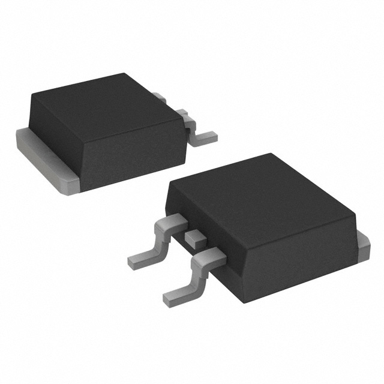

## Overview

[cols="1,3"]
|===
| Name
| Transistor Outline 263 (JEDEC)

| Synonyms
a|
* D2PAK (Double Decawatt package)
* DDPAK (Double Decawatt package)
* SMD-220 (named so because the TO-263 is the SMD equivalent of the TO-220).
* TO-263 (Transistor Outline 263, JEDEC)
* TO-263AB (TO-263-3S only)
* TO-279 (TO-263 THIN only, by Texas Instruments)

| Similar To
| link:../to-220-component-package[TO-220]

| Variants
a|
* TO-263-X1X2 (where X1 is the lead count and X2 is the length of the centre pin).
* TO-263 THIN (a thinner variant of the standard TO-263 package by Texas Instruments).

| Mounting
| SMD

| Pin Count
a|
Depends on variant.

3, 5, 7, or 9 (this is X1). All packages also have a thermal pad.

| Pitch
a|
Depends on variant.

* TO-263-3, TO-263-3S: 2.54mm
* TO-263-7, TO-263-7S: 1.7mm

| Solderability
| Easy to solder by hand, as long as you have a decent powered soldering iron for the central thermal pad. Easy to solder with infrared and reflow techniques.

| Thermal Resistance
| 

| Package LxWxH
a|
Height:

* All except TO-263 THIN: 4.57mm
* TO-263 THIN: 2.00mm

| Typical PCB Land Area
|

| 3D Models
a|
See the variant information below.

| Common Uses
a|
* High power MOSFETs
* High power LDOs
* High power SMPS (usually with integrated switching element)
|===

## The Standard Package (TO-263)

The TO-263 package can be considered the SMD version of the `TO-220AB` package. It is a 3, 5 or 7 leaded heavy-duty SMD package that allows for good heat-sinking due to a large pad on it's underside. It is used frequently for high power MOSFETs, LDOs and SMPS. Comes with either a normal middle lead (X2 = nothing) or a short, cut-off middle lead (X2 = S).

.A 3D render of the TO-263 (D2PAK) component package.

## TO-263-3

The `TO-263-3` is the 3-pin variant of the `TO-263`.

The junction-to-ambient thermal resistance for the `TO-263-3` component package on both standard JEDEC 2-layer and 4-layer boards is shown below:

.Junction-to-ambient thermal resistance data of the TO-263 component package on both standard JEDEC 2-layer and 4-layer PCBs. Image from www.ti.com.
image::d2pak-to-263-component-package-thermal-resistance-2-vs-4-layer-comparison.png[width=680px]

* stem:[T_{JA} = 18.0^{\circ}{\rm C}/W] (1 square inch of copper surrounding pads, connected to ground)
* stem:[T_{JA} = 33.6^{\circ}{\rm C}/W] (copper filling package land-area)
* stem:[T_{JA} = 36.7^{\circ}{\rm C}/W] (pads only, no copper fill)

3D models:

* link:http://www.3dcontentcentral.com/secure/download-model.aspx?catalogid=171&amp;id=168926[TO-263-3]
* link:http://www.3dcontentcentral.com/secure/download-model.aspx?catalogid=171&amp;id=168921[TO-263-3S]

## TO-263-5

The `TO-263-5` is the 5-pin variant of the `TO-263`.

Thermal resistance of the TO-263-5L THIN:

stem:[T_{JA} = 22.0^{\circ}{\rm C}/W] (no air flow, on JEDEC 4-layer test board)

3D models:

* link:http://www.3dcontentcentral.com/secure/download-model.aspx?catalogid=171&amp;id=168928[TO-263-5]
* link:http://www.3dcontentcentral.com/secure/download-model.aspx?catalogid=171&amp;id=168927[TO-263-5S]

## TO-263-7

The `TO-263-7` is the 7-pin variant of the `TO-263`.

3D models:

* link:http://www.3dcontentcentral.com/secure/download-model.aspx?catalogid=171&amp;id=167948[TO-263-7S]

## TO-263 THIN

`TO-263 THIN` is a variant of the `TO-263` component package by Texas Instruments. It shares a similar PCB footprint, but is significantly smaller in height (i.e. thinner).

.A comparison in dimensions of the standard TO-263 component package vs. the TO-263 THIN component package. Image from www.ti.com.
image::to-263-normal-vs-thin-component-package-comparison.pdf.png[width=450px]

It still has a similar exposed pad on it's underside (making it footprint compatible with the standard `TO-263` package).

The exact dimensions of the `TO-263 THIN` package are shown in <<to-263-thin-component-package-dimensions>>.

[[to-263-thin-component-package-dimensions]]
.The dimensions for the TO-263 THIN component package. Image built from elements taken from www.ti.com.
image::to-263-thin-component-package-dimensions.png[width=800px]
