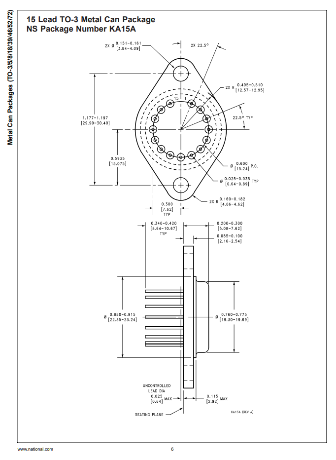

## Overview

[cols="1,3"]
|===
| Name
| Transistor Outline 3 (TO-3)

| Synonyms
a|
* TO-204AA (JEDEC TO-3-2L)
* TO-204AD (JEDEC TO-3-2L, 1.27mm thick leads)

| Similar To
a| link:../to-23-component-package[TO-23]

| Mounting
| TH

| Pin Count
| 3, 5, 8, 15 (including the case)

| Pitch
| 10.92mm (0.430") (TO-3-2L)

| Solderability
| Easy to solder by hand.

| Thermal Resistance
a|
* stem:[T_{JC} = 0.83-1.4^{\circ}{\rm C}/W] (depending on exact component)
* stem:[T_{CH} = 0.40^{\circ}{\rm C}/W] (using thermal grease)
* stem:[T_{CH} = 1.00^{\circ}{\rm C}/W] (using thermal grease with mica insulator)
* stem:[T_{JA} = 30.0^{\circ}{\rm C}/W] (typical socket mount)

| Package LxWxH
| stem:[39.94x26.67=1065mm^2] (smallest square area to enclose package)

| Typical PCB Land Area
| n/a

| 3D Models
a|
* link:https://www.3dcontentcentral.com/download-model.aspx?catalogid=171&id=363411[3dContentCentral]

| Common Uses
a|
* Transistors (TO-3-2L)
* Linear regulators (TO-3-2L)
* Op-amps (TO-3-8L)
* Diodes (TO-3-2L)
|===

Variants:

* TO-204 AA (TO-3-2L with 1.0mm pins)
* TO-204 AD
* TO-204 AE (TO-3-2L with 1.5mm pins)
* TO-3-2L (2 pins + case)
* TO-3-4L (4 pins + case)

This package comes in many variants with a different number of leads. The 2-lead device, called the `TO-3-2L` is the most common. Variants exist with up to 15 leads<<bib-ti-metal-can-packages>>!

The TO-3 package has a very low junction-to-case thermal resistance (stem:[0.8-1.5^{\,\circ}{\rm C}/W]). The TO-3 package is flange mount, which facilitates easy heatsinking. They are commonly screwed onto the metal enclosure of the device (you can sometimes see them on the outside of the enclosure!) for cheap and effective heatsinking.

Large heatsinks designed for the TO-3 package can have thermal resistances as low as stem:[0.4^{\,\circ}{\rm C/W}]. The thermal resistance between the device case and the heatsink is normally between stem:[0.5-1.7^{\,\circ}{\rm C/W}].

== TO-3-2

`TO-3-2` is the variant of the `TO-3` component package with 2 leads. `K02A` is the National Semiconductor package code for the `TO-3-2` package<<bib-ti-metal-can-packages>>.

There are three sub-variants under the `TO-3-2` banner<<bib-wp-to-3>>:

* `TO-204AA`: Standard TO-3-2 package.
* `TO-204AD`: Thicker 1.27mm leads for higher currents.
* `TO-204AE`: Even thicker 1.52mm leads for higher currents.

.Dimensions for the TO-3-2 component package
image::component-package-to-3-2l-dimensions.png[width=600px]

== TO-3-8

.A photo of the TO-3-8 component package.
image::to-3-8-component-package-photo-top-bottom.jpg[width=400px]

.Dimensions for the TO-3-8 component package.
image::component-package-to-3-8l-dimensions.jpg[width=300px]

== TO-3-15

A variant of the `TO-3` package with a exceptionally large number of leads, 15. National Semiconductor's package code for this variant is `KA15A`<<bib-ti-metal-can-packages>>.

.Dimensions of the TO-3-15 (TO-3 15 lead) component package<<bib-ti-metal-can-packages>>. Image © 2011, Texas Instruments.

[bibliography]
== References

* [[[bib-ti-metal-can-packages, 1]]] Texas Instruments (2011). _SNOA033: Metal Can Packages (TO-3/5/8/18/39/46/52/72)_. Retrieved 2021-11-08, from https://www.ti.com/lit/an/snoa033/snoa033.pdf.
* [[[bib-wp-to-3, 2]]] Wikipedia (2006, Dec 2). _TO-3_. Retrieved 2021-11-08, from https://en.wikipedia.org/wiki/TO-3.
