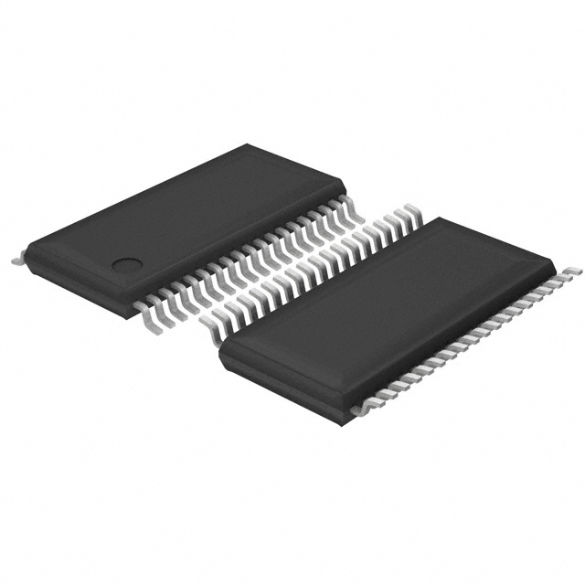

== Overview

|===
| Name
| TSSOP (Thin Scale Small Outline Package)

| Synonyms
a|
* PWP (PowerPAD) (TI's name for the HTSSOP variant, independent on pin count)<<bib-ti-drv8424ep-ds>>
* SOT1171-2 (NXP's name for the HTSSOP-28)<<bib-nxp-sot1172-2-pack-info>>
* MO-153 (JEDEC's name for the HTSSOP-28)<<bib-nxp-sot1172-2-pack-info>>

| Similar To
| n/a

| Mounting
| SMD

| Pin Count
| 8-80<<bib-wikipedia-tssop>>

| Pitch
a|
* 0.50mm<<bib-wikipedia-tssop>>
* 0.65mm

| Solderability
| Reflow is most suitable. O.K. to solder by hand by an experienced user. Care must be taken to avoid solder bridges between the legs of the IC.

| Thermal Resistance
| 

| Package LxWxH
| n/a

| Typical PCB Land Area
|

| 3D Models
a|
* n/a

| Common Uses
a|
* General ICs
* H-bridges (the HTSSOP variant)
|===

== TSSOP

TSSOP (_Thin Shrink Small Outline Package_) is a plastic, SMD IC component package with gull-wing leads.

.A 3D render of the TSSOP-38 component package.

Body widths of TSSOP packages can be 3.0, 4.4 and 6.1mm<<bib-wikipedia-tssop>>.

== HTSSOP

There is a variant of the TSSOP with a solder pad on the underside. Texas Instruments calls this the HTSSOP package<<bib-ti-lm3421-datasheet>> (Rohm Semiconductor also uses this name<<bib-rohm-htssop>>). It is used for ICs which require good thermal conductivity (e.g. half-bridges, SMPS).

* stem:[R_{\theta JA}]: Junction-to-ambient thermal resistance.
* stem:[R_{\theta JB}]: Junction-to-board thermal resistance.
* stem:[R_{\theta JC(top)}]: Junction-to-case (top) thermal resistance.
* stem:[R_{\theta JC(bot)}]: Junction-to-case (bottom) thermal resistance.

|===
| Package Name | Body Size (nominal) | stem:[R_{\theta JA}] | stem:[R_{\theta JB}] | stem:[R_{\theta JC(top)}] | stem:[R_{\theta JC(bot)}]

| HTSSOP-16
| 5.00x4.40mm<<bib-ti-lm3421-datasheet>>
| stem:[38.9^{\circ}C/W]<<bib-ti-lm3421-datasheet>>
| stem:[16.8^{\circ}C/W]<<bib-ti-lm3421-datasheet>>
| stem:[23.1^{\circ}C/W]<<bib-ti-lm3421-datasheet>>
| stem:[1.7^{\circ}C/W]<<bib-ti-lm3421-datasheet>>

| HTSSOP-20
| 6.50x4.40mm<<bib-ti-lm3421-datasheet>>
| stem:[36.7^{\circ}C/W]<<bib-ti-lm3421-datasheet>>
| stem:[18^{\circ}C/W]<<bib-ti-lm3421-datasheet>>
| stem:[21.5^{\circ}C/W]<<bib-ti-lm3421-datasheet>>
| stem:[1.9^{\circ}C/W]<<bib-ti-lm3421-datasheet>>

| HTSSOP-28
| 9.70x4.40mm<<bib-ti-drv8424ep-ds>>
| stem:[31.0^{\circ}C/W]<<bib-ti-drv8424ep-ds>>
| stem:[10.8^{\circ}C/W]<<bib-ti-drv8424ep-ds>>
| stem:[25.2 ^{\circ}C/W]<<bib-ti-drv8424ep-ds>>
| stem:[3.3^{\circ}C/W]<<bib-ti-drv8424ep-ds>>
|===

.A 3D render of the 28-pin TSSOP component package that has a thermal pad (HTSSOP-28).
image::htssop-28-component-package-3d-render-with-thermal-pad.jpg[width=320px]

[bibliography]
== References

* [[[bib-ti-lm3421-datasheet, 1]]] Texas Instruments (2008, Jul). _LM342x N -Channel Controllers for Constant-Current LED Drivers (Datasheet)_. Retrieved 2021-10-13, from https://www.ti.com/lit/ds/symlink/lm3421.pdf.
* [[[bib-nxp-sot1172-2-pack-info, 2]]] NXP (2016, Feb 8). _SOT1172-2 (Package Information)_. Retrieved 2021-10-13, from https://www.nxp.com/docs/en/package-information/SOT1172-2.pdf.
* [[[bib-ti-drv8424ep-ds, 3]]] Texas Instruments (2020, May). _DRV8424E/P, DRV8425E/P Dual H-Bridge Motor Drivers With Integrated Current Sense
and Smart Tune Technology_. Retrieved 2021-10-13, from https://www.ti.com/lit/ds/symlink/drv8424e.pdf.
* [[[bib-wikipedia-tssop, 4]]] Wikipedia (2021, Jul). _Thin shrink small outline package_. Retrieved 2021-10-13, from https://en.wikipedia.org/wiki/Thin_shrink_small_outline_package.
* [[[bib-rohm-htssop, 5]]] Rohm Semiconductor (2016, Sep 19). _Package Information : HTSSOP-B28_. Retrieved 2021-10-13, from https://fscdn.rohm.com/en/techdata_basic/ic/package/htssop-b28_1-e.pdf.
