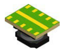
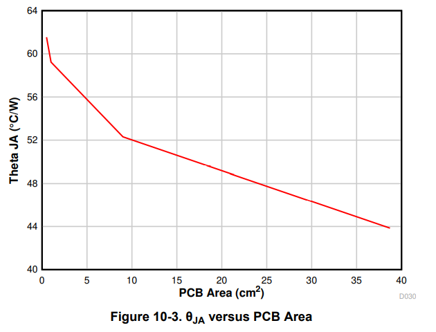

== Overview

[cols="1,3"]
|===
| Name
| uSiP (Plastic System In Package or Micro System In Package, TI)

| Synonyms
a|
* MicroSIP
* SIL (TI)

| Variants
a|
* SIL-10C (10 pin uSiP)<<bib-ti-tpsm265r1-ds>>

| Similar To
| n/a

| Mounting
| SMD

| Pin Count
| 8-33

| Pitch
a| 0.80mm<<bib-ti-tpsm265r1-ds>>

| Solderability
| Reflow is required.

| Thermal Resistance
| Depends on variant and exact component, see the Thermal Resistance section below.

| Package LxWxH
| Depends on variant.

| Typical PCB Land Area
| 

| 3D Models
a| n/a

| Common Uses
a|
* Small point-of-load power modules.
|===

The uSiP package is used for the TPSM265R1 family of point-of-load power modules (this component incorporates the SMPS buck controller, MOSFET, inductor and some of the capacitors, hence being a complete power modules).

.A 3D render of the SIL-10C 10-pin uSiP component package<<bib-ti-tpsm265r1-ds>>. Image © 2019 Texas Instruments.

== SIL-10C

* Package WxLxH: 2.8x3.7x1.8mm
* Typical Land Area: stem:[13.86mm^2] (stem:[3.3*4.2mm])

<<tpsm265r1-theta-ja-vs-copper-area>> shows stem:[\theta_{JA}] versus copper area on the PCB for the SIL-10C uSiP package.

[[tpsm265r1-theta-ja-vs-copper-area]]
.stem:[\theta_ja] vs. copper area for the TPSM265R1 power module in the SIL-10C uSiP component package<<bib-ti-tpsm265r1-ds>>.

[bibliography]
== References

* [[[bib-ti-tpsm265r1-ds, 1]]] Texas Instruments (2019, Oct). _SNVSBF6B: TPSM265R1 65-V Input, 100-mA Power Module with Ultra-Low IQ (Datasheet)_. Retrieved 2021-03-03, from https://www.ti.com/lit/ds/symlink/tpsm265r1.pdf.
