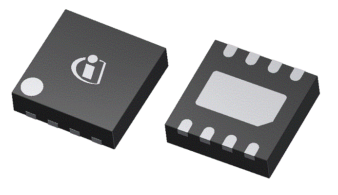

:imagesdir: 

## Overview

[cols="1,3"]
|===
| Name
| WSON (Plastic Small-outline No-lead Package)

| Image
a|

| Synonyms
a|
* DMB/PWSON (Texas Instruments)<<bib-ti-hdc1080-ds>>
* DQD (Texas Instruments)

| Similar To
a|
* link:/pcb-design/component-packages/dfn-component-package/[DFN]
* link:/pcb-design/component-packages/soic-component-package/[SOIC]
* link:/pcb-design/component-packages/uson-component-package/[USON]

| Variants
| Varying number of pins, 8 is common.

| Mounting
| SMD

| Pin Count
| 8 (all also have exposed thermal pad)

| Pitch
| Varies. Many are 1.27mm (just like SOIC, for example the Cypress WSON 8L package), the TI DMB package as a pitch of 1.0mm, and the TI DQD package as a pitch of 0.4mm.

| Solderability
| Reflow is most suitable. Hard to solder with a soldering iron due to underside thermal pad.

| Thermal Resistance
| 

| Package Dimensions
|

| Typical PCB Land Area
|

| 3D Models
a|
* link:https://www.3dcontentcentral.com/download-model.aspx?catalogid=171&id=416428[WSON-8 6x8mm]
* link:https://www.3dcontentcentral.com/download-model.aspx?catalogid=171&id=626725[WSON-10 3x3mm]

| Common Uses
a|
* Flash memory ICs
* Secondary-side bias regulators for DC-DC converters
|===

## Comments

The WSON package has a exposed thermal pad on the underside. However, it is not normally electrically connected to anything, and is optionally soldered to the PCB. It is recommended to be soldered when the PCB has a large amount of flex, else left unconnected.

.A 3D render of the WSON-8 (PG-WSON-8-1) component package from Infineon<<bib-infineon-pg-wson-8-1>>.

WARNING: Texas Instruments has a WSON package which does not have a pitch of 1.27mm!

Below is an "odd shaped" SON package used by Numonyx flash chips that goes under the name VDFPN8. Notice the half-round appearance of the pins.

.Outline and dimensions for the VDFPN8 (SON-8) component package of a Numonyx flash IC. Image from http://www.micron.com/~/media/Documents/Products/Data%20Sheet/NOR%20Flash/Serial%20NOR/M25P/M25P128.pdf.
image::component-package-vdfpn8-mlp8-outline-dimensions.png[width=500px]

Atmel produces a document titled link:http://ww1.microchip.com/downloads/en/AppNotes/QAN0027_6-Pin-SOT23-to-6-Pin-WSON_1_05.pdf[PCB Design Considerations when Changing from 6-pin SOT23 to 6-pin WSON Atmel Products]. It is a good read if you are migrating from larger SOT-23 packages to the smaller WSON package.

## The DMB/PWSON Package (Texas Instruments)

The `DMB` package (also called `PWSON`) is a variant of the `WSON` package used by Texas Instruments<<bib-ti-hdc1080-ds>>. It has a pitch of 1mm. The link:http://www.ti.com/lit/ds/symlink/hdc1080.pdf[HDC1080] datasheet is an example of a TI component which comes in the `DMB` package.

## R-PWSON/DQD Package (Texas Instruments)

The `R-PWSON`/`DQD` package is a variant of the `WSON` package used by Texas Instruments. The link:http://www.ti.com/lit/ds/symlink/tpd8f003.pdf[TPD8F003 datasheet] is an example of a TI component which comes in the `DQD` package. There seems to be a number of different packages using the `DQD` code, these include:

* `R-PWSON-N12` (12 leads)<<bib-ti-tpdxf003-ds>>
* `R-PWSON-N16` (16 leads)<<bib-ti-tpdxf003-ds>>

.The pin diagram for three different TPD8F003 family components which come in the WSON style package<<bib-ti-tpdxf003-ds>>.
image::dqd-texas-instruments-tpd8f003-wson-component-package.png[width=500px]

3D models exist for some of the DQD packages on 3DContentCentral, for example:

* link:https://www.3dcontentcentral.com/download-model.aspx?catalogid=171&id=1025764[WSON-8 (DQD)]
* link:https://www.3dcontentcentral.com/download-model.aspx?catalogid=171&id=1025763[WSON-12 (DQD)]
* link:https://www.3dcontentcentral.com/download-model.aspx?catalogid=171&id=1025762[WSON-16 (DQD)]
 
[bibliography]
## References

* [[[bib-infineon-pg-wson-8-1, 1]]] Infineon. _Packages > PG-WSON >PG-WSON-8-1_. Retrieved 2022-04-05, from https://www.infineon.com/cms/en/product/packages/PG-WSON/PG-WSON-8-1/.
* [[[bib-ti-hdc1080-ds, 2]]] Texas Instruments (2016, Jan). _HDC1080: Low Power, High Accuracy Digital Humidity Sensor with Temperature Sensor (datasheet)_. Retrieved 2022-04-05, from https://www.ti.com/lit/ds/symlink/hdc1080.pdf.
* [[[bib-ti-tpdxf003-ds, 3]]] Texas Instruments (2014, Aug). _TPDxF003: Four-, Six-, and Eight-Channel EMI Filters With Integrated ESD Protection (datasheet)_. Retrieved 2022-04-05, from https://www.ti.com/lit/ds/symlink/tpd8f003.pdf.
