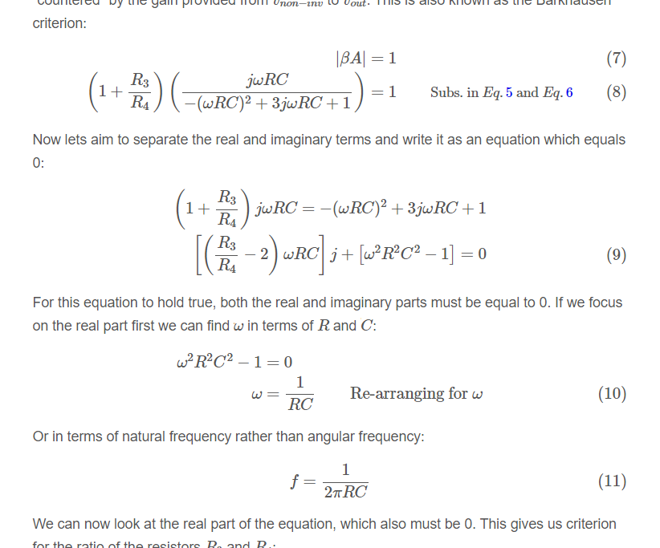
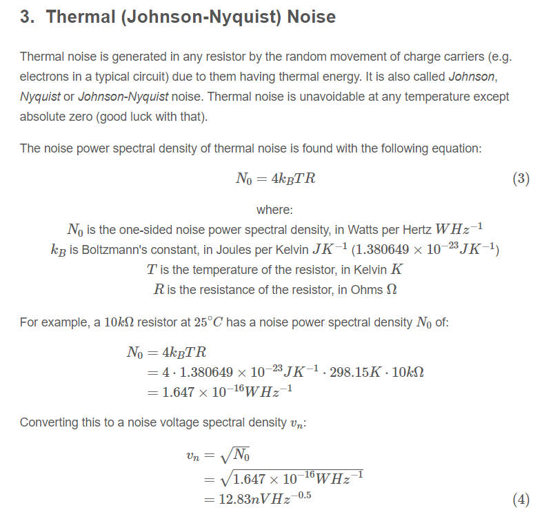

* Added equations/proofs involving the Wien bridge oscillator.
+

* Added diagrams and info on link:/electronics/components/cables#coaxial-cable[coaxial cables].
+
image::/electronics/components/cables/coax-cable-cut-away-annotated.png[width=700px]

* Added schematics and simulation results for a JFET gain-limited Wien bridge oscillator.
+
image::/electronics/components/oscillators/wien-bridge-oscillator/schematics.png[width=600px]

* Added a JFET component to the KiCad simulation library.

* Added info on link:/electronics/communication-protocols/can-protocol#can-controller-mailboxes[CAN bus mailboxes].

* Added a new page on link:/programming/hashes[Hashes].

* More info added on the link:/electronics/communication-protocols/mqtt-protocol[MQTT Paho library].

* Added a section on link:/electronics/components/oscillators/#ring-oscillators[Ring Oscillators to the Oscillators page]. Added simulation results for a three stage ring oscillator.
+
image::/electronics/components/oscillators/ring-oscillator-triple/out.png[width=600px]

* Added schematics on a link:/electronics/components/timers-and-multivibrators#basic-bjt-astable-multivibrator[BJT-based astable multivibrator]:
+
image::/electronics/components/timers-and-multivibrators/classic-bjt-astable-multivibrator.svg[width=500px]

* Added info on noise power spectral density and noise amplitude spectral density. Added more info about thermal (Johnson-Nyquist) noise including equations and a worked example involving a `\(10k\Omega\)` resistor.
+

* Added graphs of a simple moving average (SMA) filter's frequency response.
+
image::/programming/signal-processing/digital-filters/frequency-response-of-sma-magnitude.png[width=600px]

* Added link:/electronics/components/transistors/bipolar-junction-transistors-bjts#transistor-testers[photos of the vintage 'Micronta Transistor Tester' (a Radio Shack brand)] to the BJT transistors page.
+
image::/electronics/components/transistors/bipolar-junction-transistors-bjts/micronta-transistor-tester-box.jpg[width=600px]