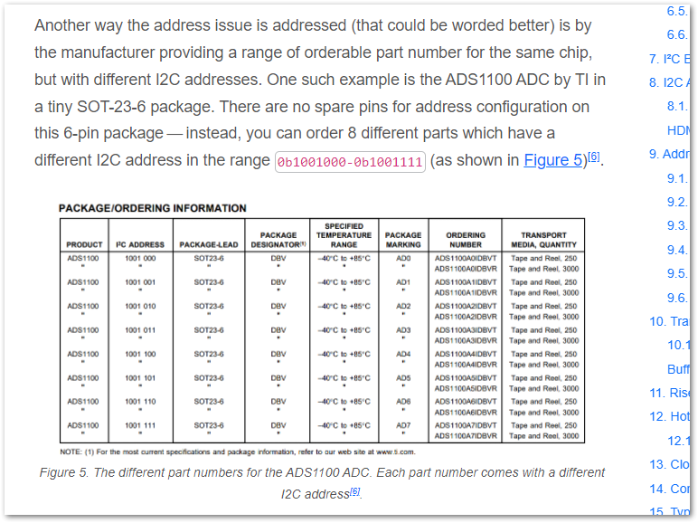
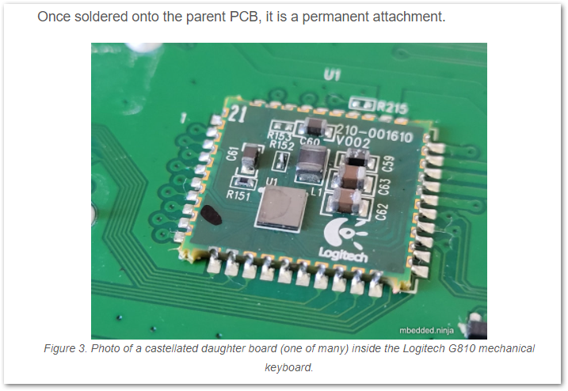
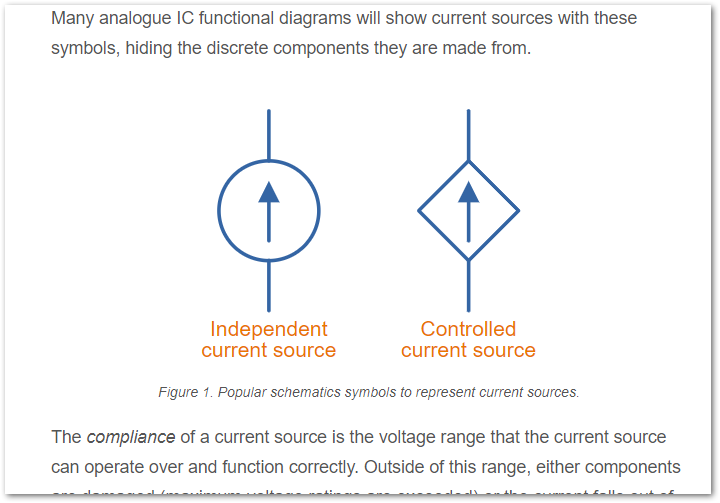
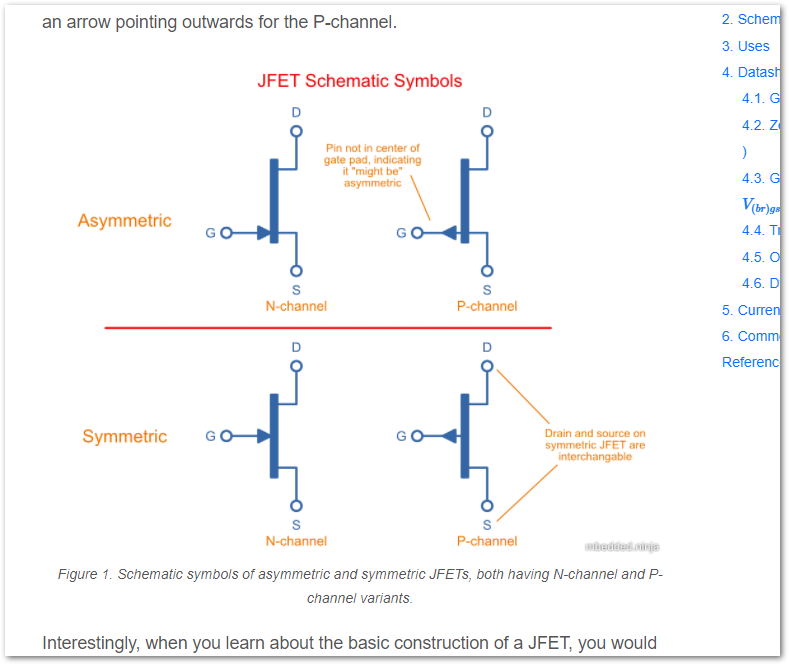
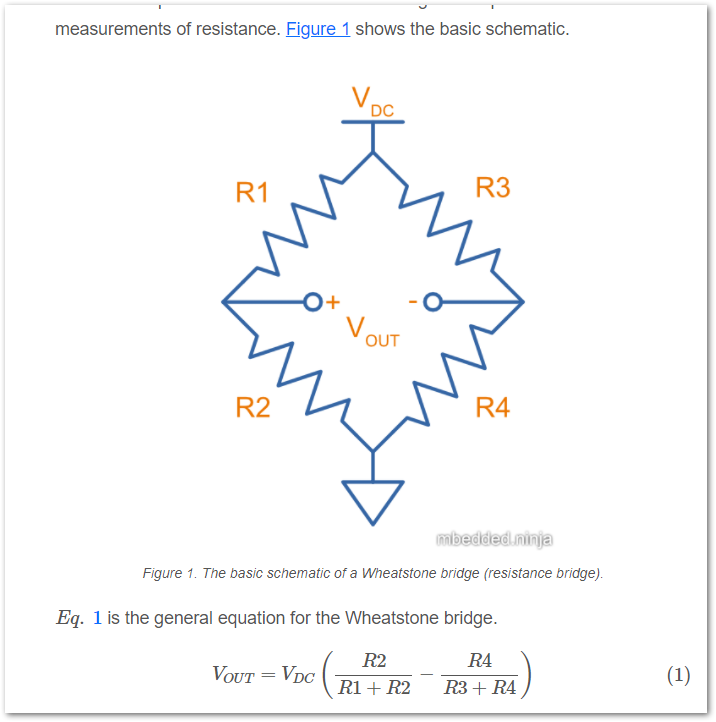
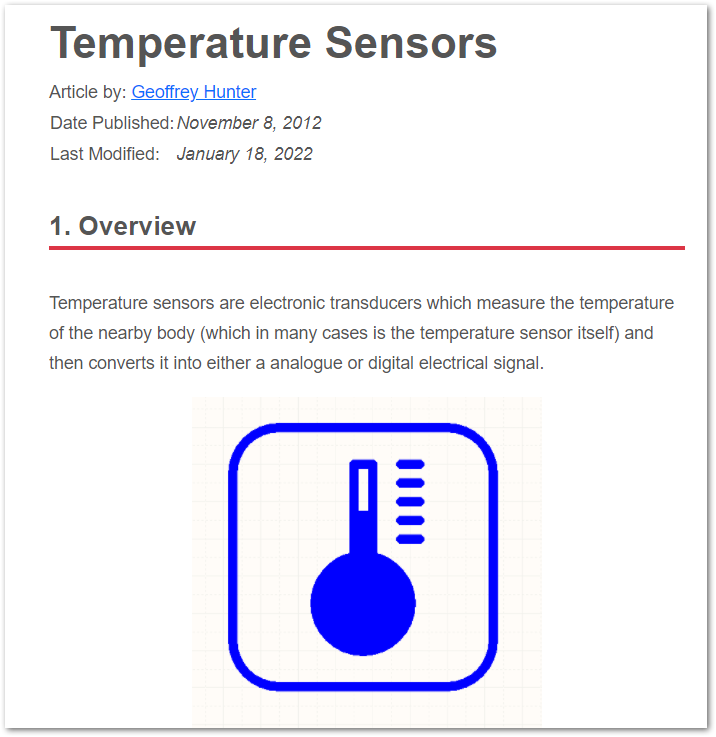
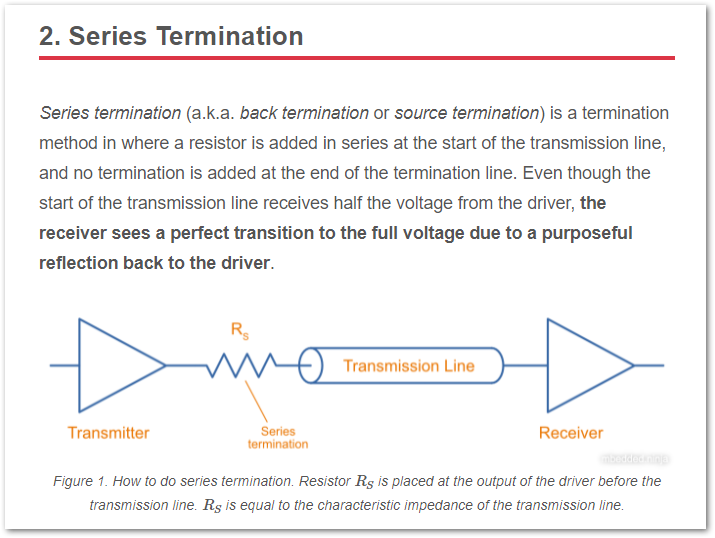
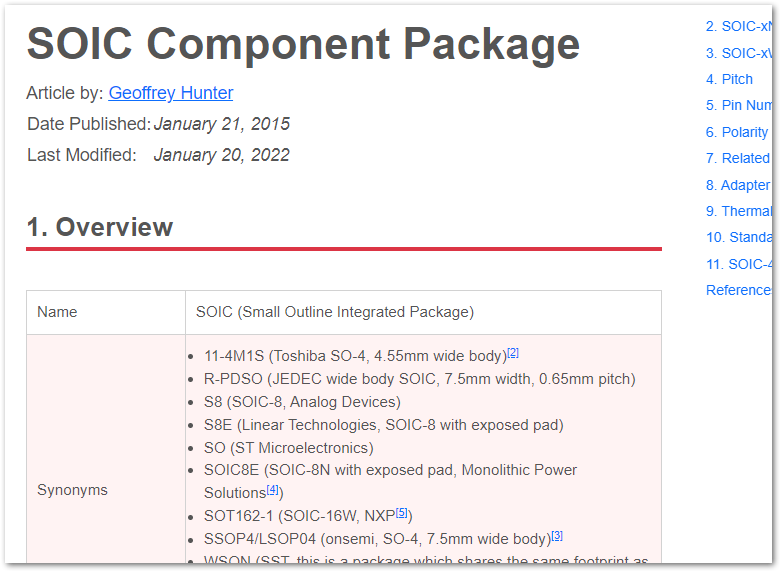
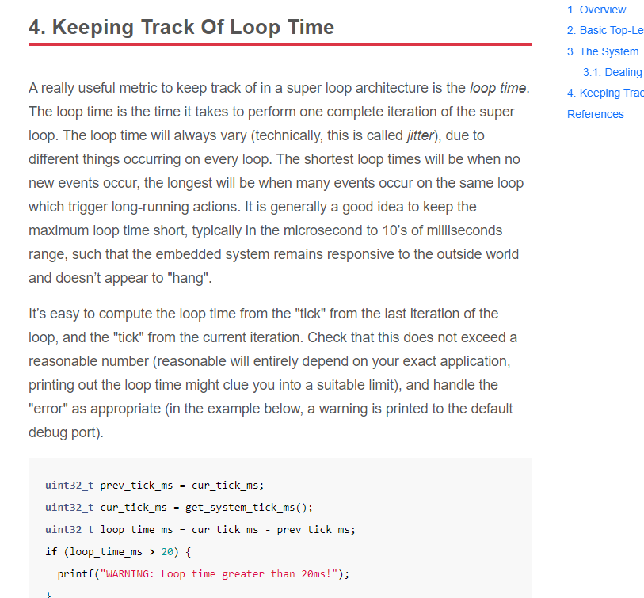

:imagesdir: 

== Updates This Month

* Added info on link:[ICs which have different part numbers for different I2C addresses].
+

* Added a link:[/pcb-design/castellation/photo of a castellated daughter board inside a Logitech G810 mechanical keyboard]. 
+

* Created a new page on link:/electronics/components/current-sources-and-sinks/[current sources and sinks], including a Zener/BJT current source and constant-current diode (JFET current source).
+

* Added link:/electronics/components/transistors/junction-gate-field-effect-transistor-jfets/[JFET schematic symbols]. Added JFET info on link:/electronics/components/transistors/junction-gate-field-effect-transistor-jfets/[transconductance and dynamic resistance].
+

* Created a new page on link:/electronics/circuit-design/wheatstone-bridges/[Wheatstone bridges].
+

* Condensed all the temperature sensor sub-pages into the link:/electronics/components/sensors/temperature-sensors/[temperature sensor page].
+

* Added a page on termination (electrical termination of transmission lines), including schematic examples of series termination. 
+

* Added more info on the SOIC component package, including the link:/pcb-design/component-packages/sot-162-1-component-package/[SOT-162-1 NXP synonym].
+

* Added info on the link:/pcb-design/component-packages/sod-123-component-package/#_sod_123ep[SOD-123EP component package], a variant of the SOD-123.
+

* Added info on link:/programming/design-patterns/how-to-write-super-loops-in-firmware/#_keeping_track_of_loop_time[monitoring loop time] to the page on firmware superloops.
+

