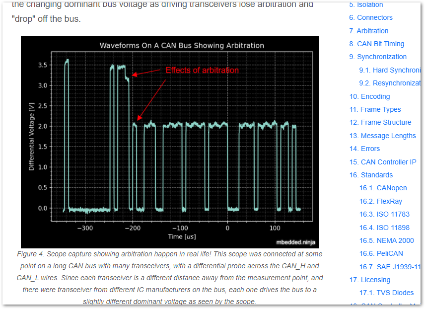
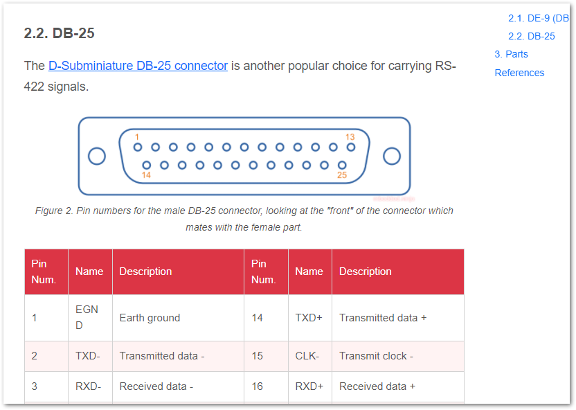
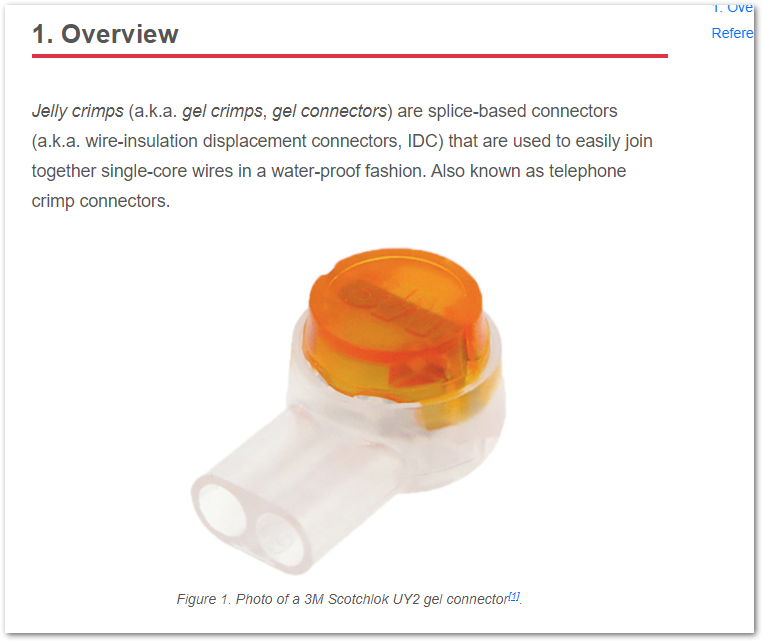
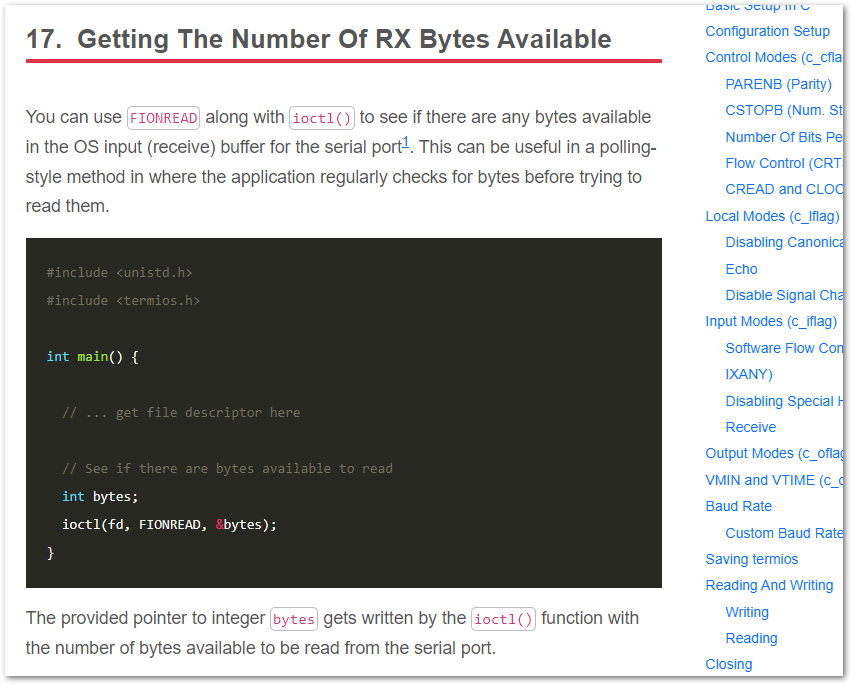
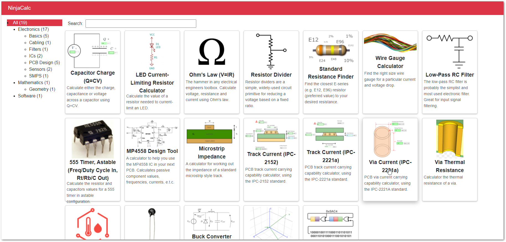

:imagesdir: 

== Updates This Month

* Added more information on link:/electronics/communication-protocols/can-protocol/#_arbitration[CAN arbitration, incl. waveforms].
+

* Created a new page on the link:/electronics/communication-protocols/rs-422-protocol/[RS-422 communication protocol].
+

* Added a new page on gel crimp connectors.
+

* Added info on link:/programming/operating-systems/linux/linux-serial-ports-using-c-cpp/[getting the number of RX bytes available in a serial port on Linux].
+

* Published a link:https://github.com/gbmhunter/CppLinuxSerial/releases/tag/v2.4.0[new release of CppLinuxSerial (v2.4.0)] with the following updates:
** Added `Available()` method to return number of bytes ready to be read from the receive buffer (thanks lotricekCZ).
** Added CMake option for shared library (thanks lotricekCZ).

* Published a link:https://ninja-calc.mbedded.ninja/[new release of NinjaCalc] with various version bumps of dependencies to fix security vulnerabilities, and a colour scheme update (to match the red used on this blog).
+

* Added a new page on link:/electronics/components/diodes/photodiodes/[photodiodes].
+

