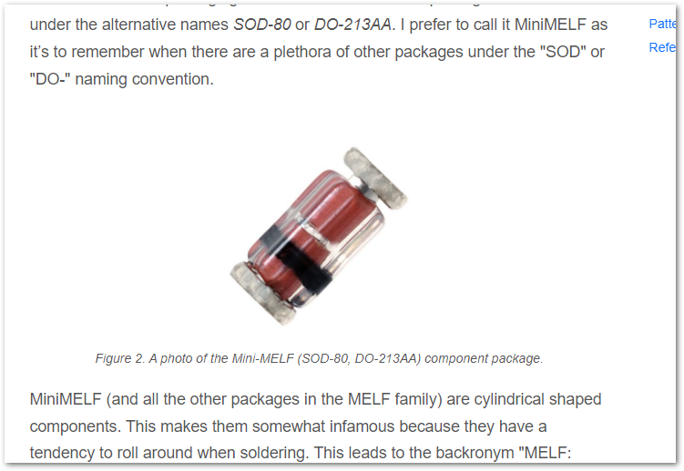
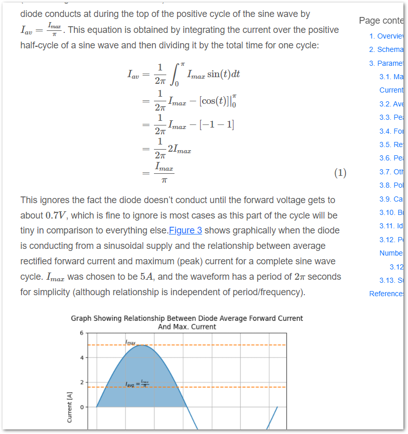
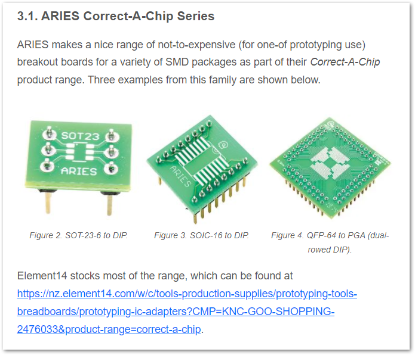
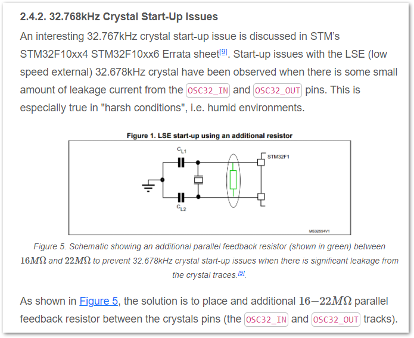
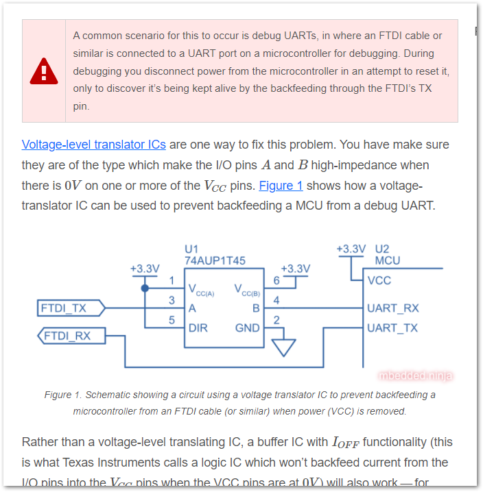
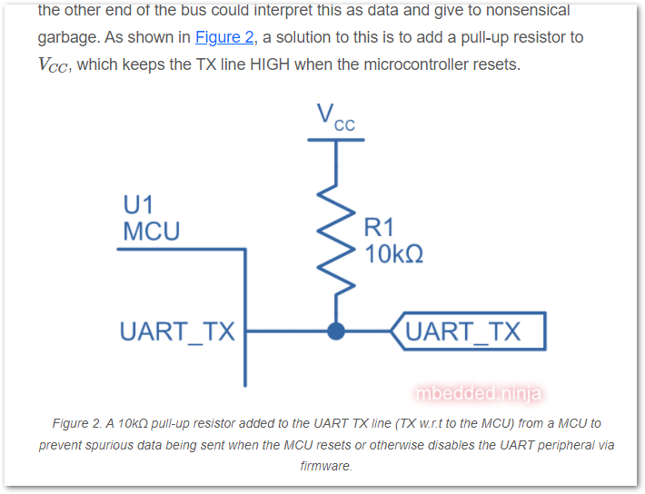
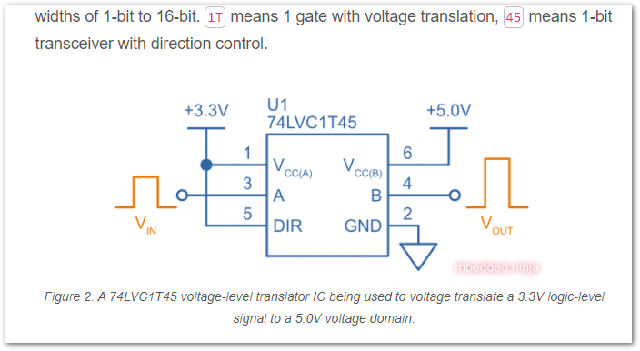
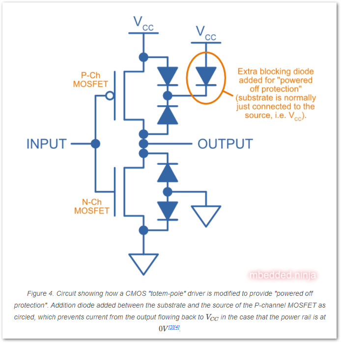

:imagesdir: 

== Updates This Month

* Added more info to the link:/pcb-design/component-packages/mini-melf-sod-80-do-213aa-component-package/[MiniMELF Component Package page].
+

* Added info on link:/electronics/components/diodes/general-purpose-diodes/#_average_rectified_forward_current[average rectified forward current for general purpose diodes].
+

* Added info on the ARIES Correct-A-Chip series of breakout boards/IC adapter PCBs.
+

* Added info on adding a link:/electronics/components/crystals-and-oscillators/#_32_768khz_crystal_start_up_issues[high-value parallel feedback resistor to 32.678kHz crystal tracks] to prevent start-up problems in humid environments.
+

* Started a page on link:/pcb-design/test-jigs/[test jigs].

* Added info on link:/electronics/communication-protocols/uart-communication-protocol/#_backfeeding_through_uart[backfeeding through UART TX/RX lines].
+

* Added info on adding link:/electronics/communication-protocols/uart-communication-protocol/#_pull_up_resistors_on_tx_lines[pull-up resistors to UART TX/RX lines to prevent spurious garbage being transmitted during microcontroller resets].
+

* Added more info on link:/electronics/components/voltage-level-translation/[voltage-level translator ICs].
+

* Added info on link:/electronics/circuit-design/logic-families/#_powered_off_protection[CMOS totem-pole drivers with added power off protection].
+

* Updated the info on the link:/pcb-design/component-packages/sod-523-component-package/[SOD-523 Component Package].