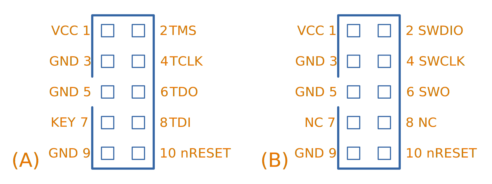
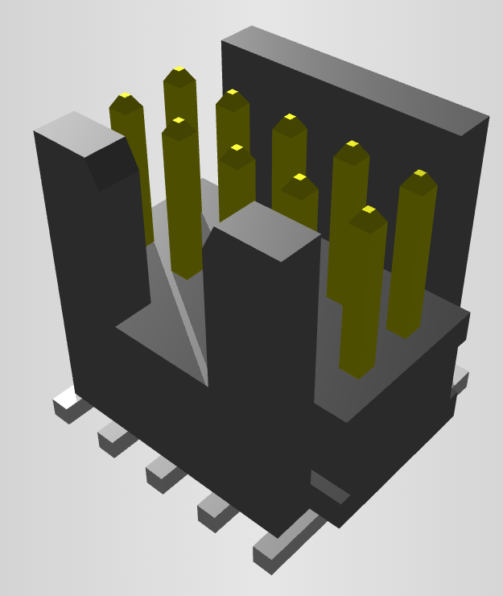
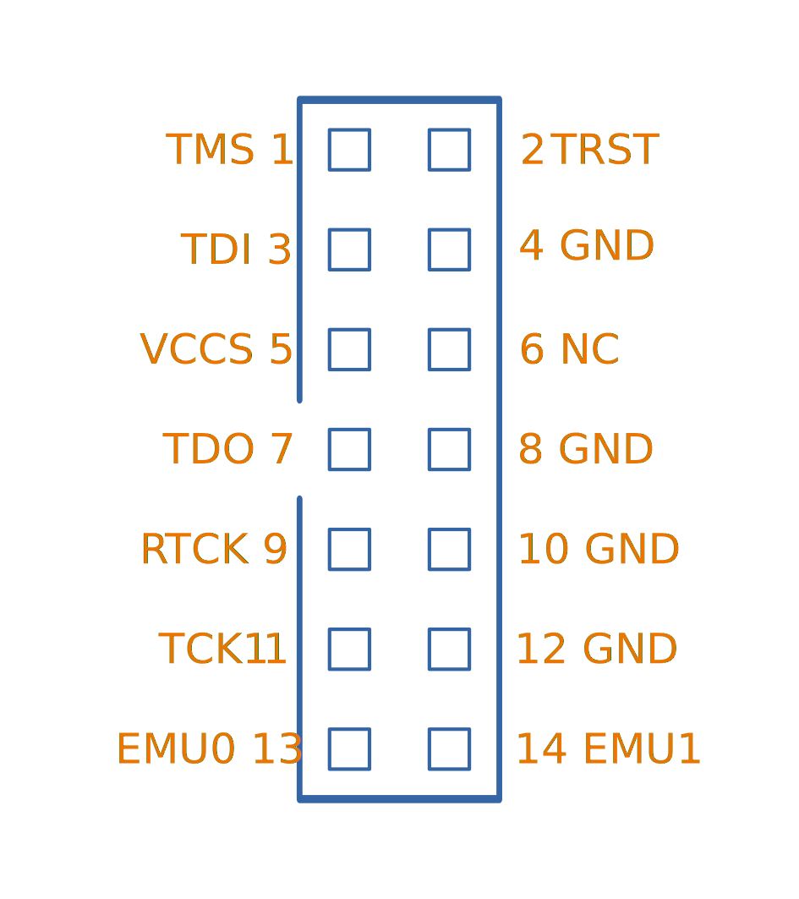
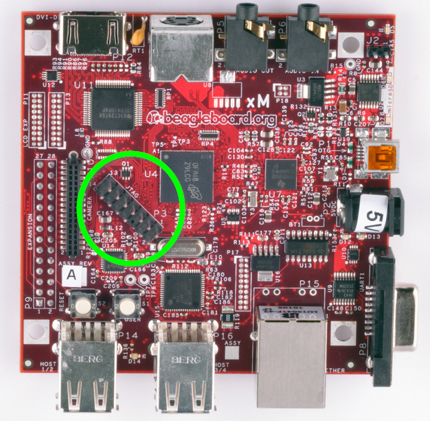
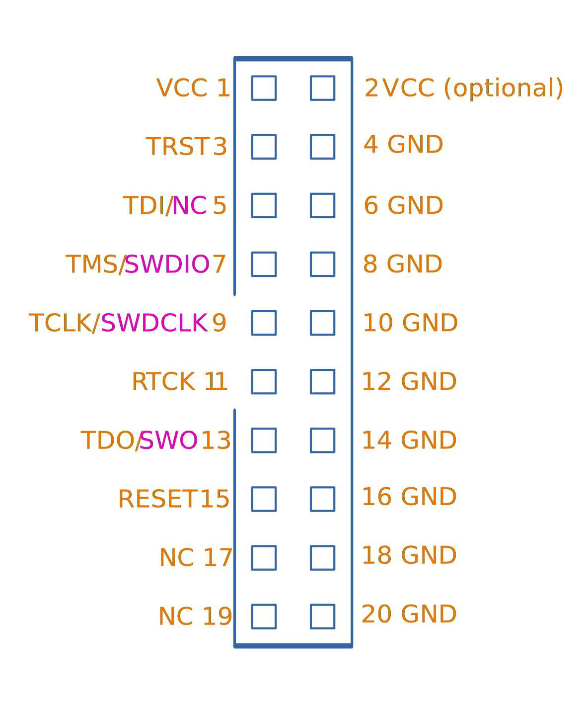
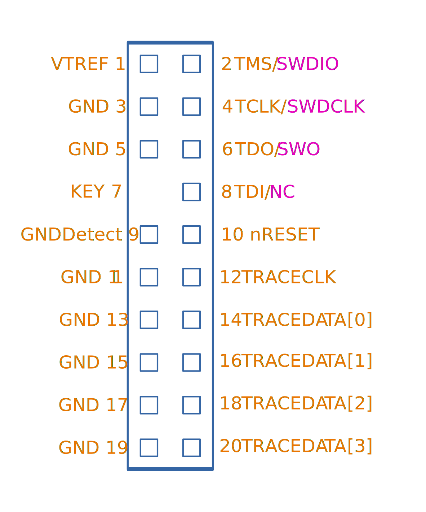

WARNING: This page is in notes format, and may not be of the same quality as other pages on this site.

== Interfaces

ARM DSTREAM?

=== JTAG

JTAG is defined in IEEE 1149.1.

[cols="1,1,4"]
.JTAG pin functions.
|===
| Name | I/O (w.r.t. programmer) | Description

| TCK
| Output
| The Test Clock pin is driven by the programmer and provides a clock for the data on the other pins.

| TDI
| Output
| The Test Data In pin is driven by the programmer and provides serial data to the target during programming/debugging.

| TDO
| Input
| The Test Data Output pin is driven by the target device and provides serial data to the programmer during programming/debugging.

| TMS
| Output
| The Test Mode Select pin is used to set the state of the Test Access Port controller.

| nRST
| Output
| The Reset pin is driven active low to reset the target device. Typically pulled high on the target board.

|===

=== SWD

=== SWV

=== ETM

4-bit.

== TagConnect

Segger has jumped on the band wagon and provides a "J-Link 6-pin Needle Adapter" which looks like a re-branded TagConnect to mate with their J-Link programmer.

== Cortex Debug Connector Pinouts

There are industry-standard connector sizes and pinouts for debugging the Cortex range of ARM-based microcontrollers (e.g. microcontrollers with a Cortex-M0, Cortex-M0+, Cortex-M3, e.t.c.).

=== 10-pin, 1.27mm Pitch

The 10-pin, 2x5, 1.27mm pitch (0.050") connector is the most common debug connector used with Cortex-based microcontrollers.

.Standard pinout for the ARM Cortex 10-pin programming connector configured for (A) JTAG and (B) SWD. NC pins are **N**ot **C**onnected (i.e. not used)<<bib-keil-coresight-conn>>.

The official connector is the link:https://www.samtec.com/products/ftsh-105-01-l-dv-k[Samtec FTSH-105-01], yet luckily these header-style connectors are standardized across manufacturers and almost any 1.27mm 2x5 header-style connector will work.

.3D model of the Samtec FTSH-105-01 10-pin 2x5 1.27mm pitch SMD header<<bib-samtec-ftsh-105-01>>.

Sometimes `Pin 7` is removed from the male header, and the female header has a blank position in the same location (i.e. no receptacle). This is to "key" the header so it can't be mated incorrectly. Another way of preventing incorrect mating is to use a keyed shroud.

`Pin 9 (GND)` can also be used for detection.

=== 14-pin TI Connector

.Pinout for the TI 14-pin JTAG connector<<bib-segger-ti-14pin>><<bib-ti-jtag-conns>>.

The `EMU0` and `EMU1` pins can be used for cross-core triggering (e.g. one core halts and signals the other cores to halt)<<bib-ti-jtag-conns>>. They are not supported by ARM DSTREAM<<bib-arm-dstream-interface-ref>>.

The BeagleBoard Rev D and Beagleboard-xM use this connector.

.Photo highlighting the 14-pin TI style JTAG connector on the BeagleBoard-xM<<bib-beagleboard-xm>>.

=== 20-pin ARM "Standard" Debug Connector Pinout

This is the most common 20-pin debug connector pinout for an ARM device.

.Pinout for the 20-pin "standard" ARM debug connector<<bib-keil-coresight-conn>>.

NOTE: Pin 2 may be specified as either `VCC (optional)` or `NC` (not connected). In most situations I've seen this as `NC`.

=== 20-pin Cortex Debug + ETM Connector Pinout

.Pinout for the "Cortex Debug + ETM Connector" 20-pin debug connector<<bib-keil-coresight-conn>>.

Supported by the ULINKPro.

=== 38-pin Mictor Connector

Connecting a trace probe to a ARM target.

[bibliography]
== References

* [[[bib-keil-coresight-conn, 1]]]: Keil. _CoreSight Connectors_. Retrieved 2021-11-05, from https://www2.keil.com/coresight/coresight-connectors.
* [[[bib-samtec-ftsh-105-01, 2]]]: Samtec. _FTSH-105-01-L-DV-K High Reliability Header Strips, 0.050" pitch_. Retrieved 2021-11-05, from https://www.samtec.com/products/ftsh-105-01-l-dv-k.
* [[[bib-segger-ti-14pin, 3]]] Segger. _14-Pin TI Adapter_. Retrieved 2021-11-07, from https://www.segger.com/products/debug-probes/j-link/accessories/adapters/14-pin-ti-adapter/.
* [[[bib-ti-jtag-conns, 4]]] Texas Instruments. _JTAG Connectors and Pinout_. Retrieved 2021-11-07, from http://software-dl.ti.com/ccs/esd/documents/xdsdebugprobes/emu_jtag_connectors.html.
* [[[bib-arm-dstream-interface-ref, 5]]] ARM. _ARM DSTREAM System and Interface Design Reference: TI JTAG 14_. Retrieved 2021-11-07, from https://developer.arm.com/documentation/dui0499/d/ARM-DSTREAM-Target-Interface-Connections/TI-JTAG-14.
* [[[bib-beagleboard-xm, 6]]] Beagleboard (2017, May 4). _BeagleBoard-xM_. Retrieved 2021-11-07, from https://beagleboard.org/beagleboard-xm.