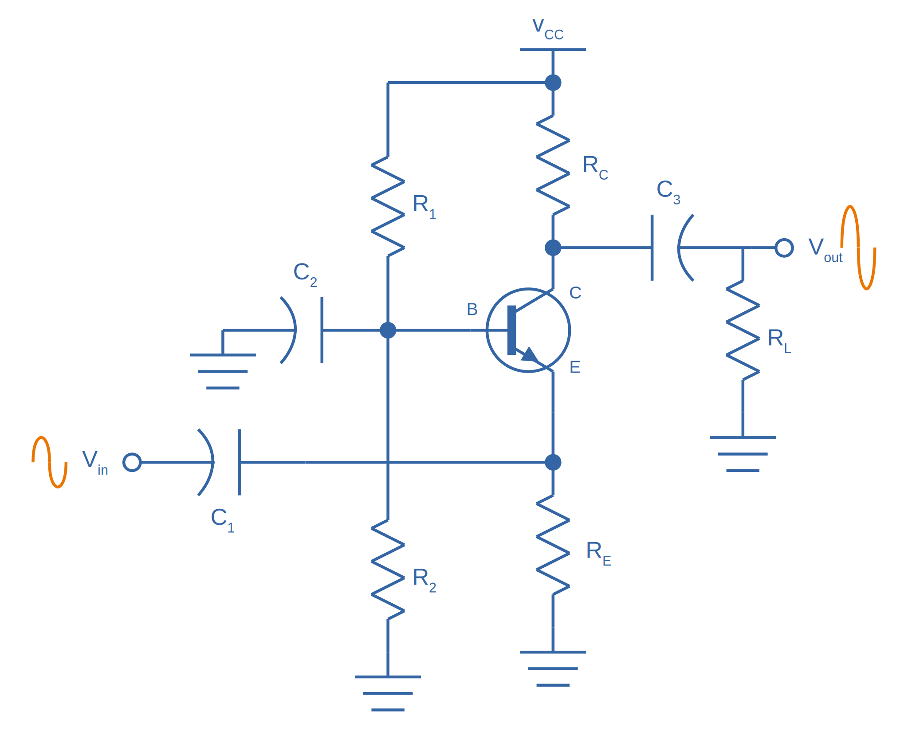

:toc:
:xrefstyle: short
:stem: latexmath
:sectnums:

Table of contents should be shown above^^^. Sections should have numbers in front of them, both in the ToC and in-front of the section headings.

== Maths

An example on an inline equation stem:[y = \frac{1}{x^2}] is embedded in this sentence.

And here is a block-level equation. There second line of the equation should be numbered.

[stem]
++++
\begin{align}
y = \frac{1}{x^2} \nonumber \\
y = 2
\end{align}
++++

== Code

Inline `uint8_t code` is here.

Below is a C++ code block:

.Some C++ code
[source,c++]
----
include <stdio>

int main() {
    std::cout << "Testing..." << std::endl;
    return 0;
}
----

Below is a Ruby code block:

.Some Ruby code
[source,ruby]
----
require 'sinatra'

get '/hi' do
  "Hello World!"
end
----

== Images

There should be a vector image below that is `300px` wide, with the caption "Hello, world":

.Hello, world

== References

This sentence contains a bibliographic reference at the end of it<<example-bib>>.

== Tables

|===
| Header Col. 1 | Header Col. 2

| Cell 1, 1 | Cell 1, 2
| Cell 2, 1 | Cell 2, 2
|===

== Admonitions

TIP: This is a tip. I should be green and have a bulb icon on my left.

WARNING: This is a warning. I should be red.

== Links

Here is a URL: link:www.google.com[www.google.com].

[bibliography]
== References

* [[[example-bib]]] Bibliography text goes here.